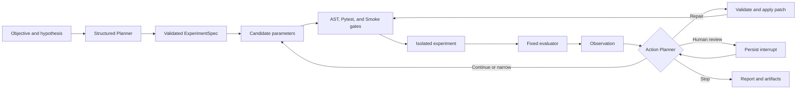

# AutoExp


<p align="center">
  <a href="https://github.com/HeZhongTian-xjtu/AutoExp/blob/main/README.md">中文</a> |
  <a href="https://github.com/HeZhongTian-xjtu/AutoExp/blob/main/README.en.md">English</a>
</p>

<a id="english-documentation"></a>

> A controlled machine-learning experiment agent for planning, running, improving, and auditing reproducible experiments.


AutoExp turns a research objective and hypothesis into a bounded experiment loop. An LLM creates a structured experiment plan, LangGraph coordinates Trial execution and result-driven decisions, and deterministic guards validate every parameter, patch, metric, and artifact.

The project is intentionally constrained. Model-generated decisions are separated from trusted evaluation, resource limits, persistence, and code-validation gates so that an experiment can be inspected and reproduced instead of treated as an opaque chat session.

## Core Capabilities

- **Stateful orchestration:** LangGraph nodes, conditional routing, checkpoints, resume, and persisted human-review interrupts.
- **Structured planning:** Pydantic `ExperimentSpec` outputs for objectives, hypotheses, metrics, budgets, and initial parameters.
- **Closed-loop optimization:** the Action Planner can continue, narrow the search, repair code, stop, or request review after each Trial.
- **Guarded Code Repair:** allowlisted Unified Diff patches pass context validation, AST/dependency checks, Pytest, and Smoke gates before execution.
- **Controlled execution:** Local and Docker executors share one protocol; Docker applies network, privilege, CPU, memory, PID, and timeout restrictions.
- **Fixed evaluation:** immutable dataset identity and template-owned evaluators prevent generated code from redefining the success metric.
- **Persistent evidence:** SQLite stores Runs, Trials, decisions, and events; artifacts store reports, logs, patches, predictions, and evaluator outputs.
- **One execution core:** Streamlit, CLI, FastAPI, and the RQ worker call the same application service and LangGraph workflow.
- **Optional integrations:** OpenAI-compatible model providers, MLflow experiment tracking, Redis/RQ background jobs, and SSE progress events.

## Workflow



A Run is bounded by its Trial count, elapsed-time budget, per-Trial timeout, Repair limit, template policy, and executor resources. The graph state and event timeline record every transition.

## Architecture

```text
Streamlit / CLI / FastAPI / RQ Worker
                  |
                  v
       AutoExpApplicationService
                  |
                  v
       LangGraph Experiment Agent
        /          |           \
   Planner     TrialRunner    Reporting
                  |
       Preflight -> Executor -> Evaluator
                  |
       SQLite / Artifacts / MLflow
```

| Package | Responsibility |
| --- | --- |
| `autoexp/application` | Shared application service, catalogs, runtime assembly, and Trial coordination |
| `autoexp/domain` | Stable schemas for experiments, actions, observations, Runs, Trials, datasets, and Repairs |
| `autoexp/graph` | Canonical LangGraph state, nodes, routing, checkpoints, resume, and interrupts |
| `autoexp/planning` | Initial Planner, Action Planner, candidate policies, and deterministic fallback |
| `autoexp/preflight`, `autoexp/validation` | Static checks and the AST -> Pytest -> Smoke gate pipeline |
| `autoexp/execution`, `autoexp/evaluation` | Local/Docker execution, dataset integrity, fixed metrics, and evaluators |
| `autoexp/persistence`, `autoexp/tracking` | SQLite, content-addressed artifacts, and optional MLflow tracking |
| `autoexp/repair`, `autoexp/reporting` | Repair context and patch validation, deterministic reports, and optional AI summaries |
| `autoexp/server`, `autoexp/webui` | FastAPI/RQ/SSE services and the Streamlit interface |

## Quick Start

### Requirements

- Python 3.10 or 3.11
- Docker Desktop or Docker Engine for isolated execution
- An OpenAI-compatible API key for LLM planning, AI summaries, or LLM Repair
- Redis only when background jobs are enabled

### Install

```powershell
git clone https://github.com/HeZhongTian-xjtu/AutoExp.git
cd AutoExp
py -3.10 -m venv .venv
.\.venv\Scripts\python.exe -m pip install --upgrade pip
.\.venv\Scripts\python.exe -m pip install -r requirements.txt
```

On Linux or macOS, create a Python 3.10+ virtual environment and replace the Windows executable path with `python`.

### Start the Web UI

```powershell
.\.venv\Scripts\python.exe -m streamlit run autoexp\webui\app.py
```

Open `http://localhost:8501`, choose an experiment template, and register a compatible `train.csv` in the Dataset panel. Use Local execution only for trusted development code.

For isolated Trials, build the runner image before selecting Docker in the UI:

```powershell
docker build -f Dockerfile.autoexp -t autoexp-runner:latest .
```

### Run from the CLI

After registering a dataset through the Web UI, use its dataset ID with the shared CLI:

```powershell
.\.venv\Scripts\python.exe scripts\run_autoexp_demo.py `
  --template housing-regression-v1 `
  --dataset-id YOUR_DATASET_ID `
  --planner deterministic `
  --executor local `
  --tracker none `
  --trials 2
```

Use `--planner llm --executor docker` for an LLM-planned isolated Run. CLI and Web results use the same service, graph, persistence model, and evaluator contracts.

### Start the Service Stack

```powershell
Copy-Item .env.example .env
docker build -f Dockerfile.autoexp -t autoexp-runner:latest .
docker compose up -d --build
.\.venv\Scripts\python.exe -m autoexp.server.worker
```

| Service | Address |
| --- | --- |
| Streamlit | `http://localhost:8501` |
| FastAPI | `http://localhost:8000` |
| MLflow | `http://localhost:5000` |
| Redis | `localhost:6379` |

The RQ worker should run only on a trusted host with Docker access. The Compose file is a local integration environment, not a hardened public deployment.

## Model Configuration

Copy `.env.example` to `.env` and configure an OpenAI-compatible endpoint:

```dotenv
OPENAI_API_KEY=your-api-key
OPENAI_BASE_URL=https://api.deepseek.com
AUTOEXP_PLANNER_MODEL=deepseek-v4-flash
```

AutoExp uses the OpenAI SDK contract and supports OpenAI, DeepSeek, and compatible gateways. `.env` is ignored by Git; never commit credentials.

Common runtime settings include:

| Variable | Purpose |
| --- | --- |
| `AUTOEXP_PLANNER_MODE` | `deterministic`, `llm`, or `auto` planning |
| `AUTOEXP_EXECUTOR` | `local` or `docker` Trial execution |
| `AUTOEXP_TRACKER` | `none` or `mlflow` tracking |
| `AUTOEXP_DB_PATH` | SQLite Run database |
| `AUTOEXP_ARTIFACT_ROOT` | Run artifact directory |
| `AUTOEXP_API_TOKEN` | Optional FastAPI bearer token |

## Tasks and Datasets

Each experiment template defines its metric, parameter policy, weak baseline, mutable files, evaluator, validation commands, and resource limits.

| Template | Dataset and source | Required target | Metric |
| --- | --- | --- | --- |
| `housing-regression-v1` | [Kaggle House Prices](https://www.kaggle.com/competitions/house-prices-advanced-regression-techniques/data) | `SalePrice` | RMSE-log, minimize |
| `covertype-classification-v1` | [UCI Covertype](https://archive.ics.uci.edu/dataset/31/covertype) | `Cover_Type` | Macro-F1, maximize |
| `bank-marketing-classification-v1` | [UCI Bank Marketing](https://archive.ics.uci.edu/dataset/222/bank%2Bmarketing) | `y` | Average precision, maximize |
| `online-shoppers-classification-v1` | [UCI Online Shoppers](https://archive.ics.uci.edu/dataset/468/online%20shoppers%20purchasing%20intention%20dataset) | `Revenue` | Average precision, maximize |
| `text-classification-v1` | User-provided compatibility dataset | `text`, `label` | Macro-F1, maximize |

The repository contains task contracts and provenance information, not third-party dataset files. Users must obtain data from the original source, follow its terms, and upload a compatible copy. UCI datasets listed above use CC BY 4.0; Kaggle data remains subject to its data page and competition rules.

Uploaded datasets are validated, assigned a SHA-256 identity, and stored below `workspaces/datasets/`. Runtime datasets, databases, logs, checkpoints, and artifacts are excluded from Git.

## Agent Evaluation

AutoExp was compared with Random Search and Optuna using the same four formal tasks, registered search spaces, weak baselines, five seeds (`42`-`46`), and Trial budgets. Text Classification was excluded. Code Repair was disabled so the comparison measures parameter optimization only; each budget contains 60 Runs, all of which completed successfully.

<table>
  <thead>
    <tr>
      <th rowspan="2">Method</th>
      <th colspan="2">Wins</th>
      <th colspan="2">Mean rank</th>
      <th colspan="2">Mean time</th>
    </tr>
    <tr>
      <th>2 Trials</th>
      <th>6 Trials</th>
      <th>2 Trials</th>
      <th>6 Trials</th>
      <th>2 Trials</th>
      <th>6 Trials</th>
    </tr>
  </thead>
  <tbody>
    <tr>
      <td>Random</td>
      <td>5/20 (25%)</td>
      <td>4/20 (20%)</td>
      <td>2.40</td>
      <td>2.30</td>
      <td>21.36s</td>
      <td>74.02s</td>
    </tr>
    <tr>
      <td>Optuna</td>
      <td>7/20 (35%)</td>
      <td>5/20 (25%)</td>
      <td>1.80</td>
      <td>2.05</td>
      <td>22.70s</td>
      <td>76.62s</td>
    </tr>
    <tr>
      <td>AutoExp LLM</td>
      <td><strong>8/20 (40%)</strong></td>
      <td><strong>11/20 (55%)</strong></td>
      <td><strong>1.80</strong></td>
      <td><strong>1.65</strong></td>
      <td>28.57s</td>
      <td>137.33s</td>
    </tr>
  </tbody>
</table>

Two-Trial task results (`mean +/- sample standard deviation`):

| Task | Random | Optuna | AutoExp LLM | Best |
| --- | ---: | ---: | ---: | --- |
| Housing, RMSE-log (minimize) | 0.2459 +/- 0.1046 | 0.1958 +/- 0.1094 | **0.1345 +/- 0.0114** | AutoExp |
| Covertype, Macro-F1 (maximize) | 0.6932 +/- 0.1781 | **0.7646 +/- 0.0832** | 0.6972 +/- 0.1931 | Optuna |
| Bank Marketing, AP (maximize) | 0.5334 +/- 0.0140 | 0.5369 +/- 0.0099 | **0.5389 +/- 0.0083** | AutoExp |
| Online Shoppers, AP (maximize) | 0.6403 +/- 0.0214 | 0.6430 +/- 0.0224 | **0.6453 +/- 0.0235** | AutoExp |

Six-Trial task results under the same protocol:

| Task | Random | Optuna | AutoExp LLM |
| --- | ---: | ---: | ---: |
| Housing, RMSE-log (minimize) | 0.1522 +/- 0.0246 | 0.1456 +/- 0.0333 | **0.1298 +/- 0.0107** |
| Covertype, Macro-F1 (maximize) | 0.8120 +/- 0.0223 | 0.8322 +/- 0.0275 | **0.8536 +/- 0.0051** |
| Bank Marketing, AP (maximize) | 0.5406 +/- 0.0055 | 0.5410 +/- 0.0055 | **0.5411 +/- 0.0055** |
| Online Shoppers, AP (maximize) | **0.6459 +/- 0.0236** | 0.6457 +/- 0.0234 | 0.6457 +/- 0.0233 |

With two Trials, all policies are sensitive to favorable samples from the bounded search space. At six Trials, AutoExp's paired win rate rises to 55%, with its clearest advantage on Housing and Covertype. Bank Marketing and Online Shoppers remain effectively close. The LLM policy also has higher latency, so the result demonstrates a quality-cost tradeoff rather than universal dominance.

The tables above record the four-task evaluation snapshot. Once compatible datasets are available locally, the tracked command below reproduces the registered Phase 1 subset: Housing, Covertype, and Bank Marketing.

```powershell
.\.venv\Scripts\python.exe scripts\run_optimization_benchmark.py `
  --all-tasks `
  --policies random optuna llm `
  --seeds 42 43 44 45 46 `
  --trials 6 `
  --output workspaces\benchmarks-6
```

## Isolation and Safety

AutoExp treats generated code as untrusted input:

- template manifests define editable files, allowed dependencies, metrics, parameter policies, and resource limits;
- structured schemas validate model outputs before they reach the runtime;
- Repair patches must match the current source and pass the complete validation pipeline;
- Docker Trials run without network access or API keys, as a non-root user, with a read-only root and bounded resources;
- fixed evaluators and dataset hashes keep the optimization target independent of generated training code;
- repeated failures and duplicate rejected patches stop automatic Repair and can route to human review.

These controls reduce risk but do not make the current stack suitable for untrusted public multi-tenant execution. See [SECURITY.md](SECURITY.md) for reporting and deployment guidance.

## Repository Layout

```text
autoexp/                 core application, graph, planning, execution, and services
experiment_templates/    versioned task manifests, training code, and evaluators
repair_benchmarks/       controlled Code Repair fixtures
scripts/                 CLI, dataset preparation, and reproducible benchmark commands
docs/assets/             README media
workspaces/              local Runs, datasets, databases, and artifacts (ignored)
```

## Development

```powershell
.\.venv\Scripts\python.exe -m pip install -e ".[dev]"
.\.venv\Scripts\ruff.exe check autoexp scripts
.\.venv\Scripts\black.exe --check autoexp scripts
```

New templates should provide a manifest, weak baseline, bounded parameter policy, fixed evaluator, validation command, and resource policy. New user-facing capabilities should be exposed through `AutoExpApplicationService` so Web, CLI, API, and Worker behavior remain aligned.

## Scope

AutoExp is an alpha-stage local research and engineering project. It focuses on controlled tabular machine-learning experimentation. It is not a general AutoML platform, a hosted multi-tenant service, or a literature/RAG system. Public deployment still requires production authentication, TLS, network policy, secret management, observability, and host-level quotas.

## Contributing

Issues and pull requests are welcome. Include the template, planner/executor/tracker modes, operating system, reproduction command, Run status, and sanitized logs. Do not attach API keys, private datasets, or sensitive source code.

## License

AutoExp is released under the [MIT License](LICENSE).
