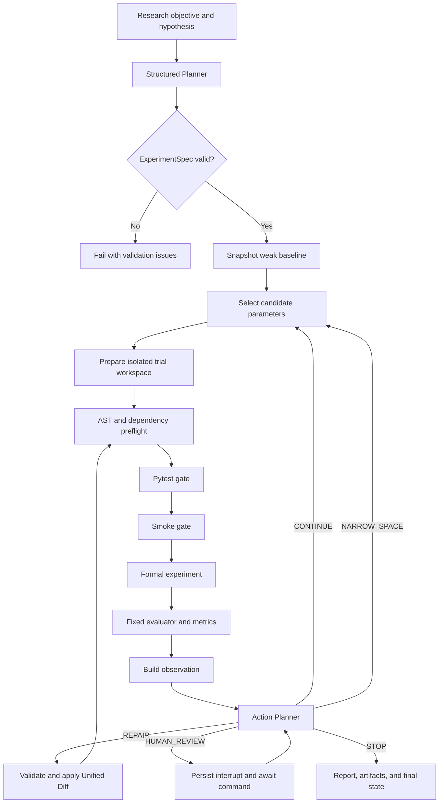

# AutoExp


<p align="center">
  <a href="https://github.com/HeZhongTian-xjtu/AutoExp?tab=readme-ov-file#english-documentation">English</a> |
  <a href="https://github.com/HeZhongTian-xjtu/AutoExp/blob/main/README.zh-CN.md">中文</a>
</p>

<a id="english-documentation"></a>
> A controlled autonomous machine-learning experiment agent built for transparent, reproducible, and inspectable optimization.

## Demo


AutoExp turns a research objective and hypothesis into a bounded machine-learning experiment loop. An LLM or deterministic planner produces a structured experiment specification, the system validates it against a registered template, executes controlled trials, evaluates fixed metrics, and lets an action planner decide whether to continue, narrow the search space, repair code, stop, or request human review.

The project is designed as an engineering and research portfolio project. Its focus is not unrestricted code generation; its focus is making Agent decisions, code changes, experiment state, metrics, failures, and artifacts explicit and auditable.

**Current status:** the local Web/CLI workflow, LangGraph state machine, SQLite persistence, Docker trial isolation, Repair gates, MLflow integration, background-task API, and reproducible optimization benchmarks are implemented. Public deployment hardening remains intentionally out of scope for the current release.

## Why AutoExp

A useful experiment agent needs more than an LLM call followed by `python train.py`. AutoExp separates probabilistic model decisions from deterministic enforcement:

| LLM or policy component | Deterministic system boundary |
| --- | --- |
| Propose an `ExperimentSpec` | Validate it against the template manifest and resource budget |
| Select the next parameters | Reject unknown, duplicated, or out-of-policy values |
| Propose a Unified Diff repair | Enforce file allowlists, patch context, AST, dependency, Pytest, and Smoke gates |
| Interpret trial observations | Compute metrics with a fixed evaluator and immutable dataset identity |
| Generate a human-readable summary | Persist the complete run, decisions, failures, and artifacts independently |

This boundary makes the result reproducible enough for comparison while still demonstrating structured LLM planning, function-style outputs, stateful Agent control, automatic experimentation, and code repair.

## Highlights

- **LangGraph orchestration** with explicit nodes, conditional routing, SQLite checkpoints, resume, and human-review interrupts.
- **Structured planning** that converts an objective and hypothesis into a validated Pydantic `ExperimentSpec`.
- **Result-conditioned actions**: `CONTINUE`, `NARROW_SPACE`, `REPAIR`, `STOP`, and `HUMAN_REVIEW`.
- **Controlled Code Agent** that collects failure context, generates allowlisted Unified Diff patches, rejects duplicate failures, and preserves Repair artifacts.
- **Execution gates** in the order `AST/dependency -> Pytest -> Smoke -> formal experiment`.
- **Local and Docker executors** behind one execution protocol.
- **Docker isolation** with no network, non-root execution, read-only container root, dropped capabilities, CPU/memory/PID limits, and immutable file mounts.
- **Dataset registry** for uploaded datasets, compatibility checks, SHA-256 identity, local previews, and immutable staging.
- **SQLite and artifact persistence** for runs, trials, decisions, events, reports, patches, logs, and resumable state.
- **Optional MLflow tracking** with an aggregate parent run and per-trial child runs; SQLite remains authoritative.
- **Unified Web and CLI core** through `AutoExpApplicationService` and the same LangGraph workflow.
- **FastAPI + Redis/RQ + SSE control plane** for queued long-running experiments and progress events.
- **Reproducible benchmarks** for Random, Optuna, and LLM parameter policies, plus controlled Repair cases.
- **Deterministic report and optional AI Run Summary** without hiding the underlying trial details.

## Workflow



A run is bounded by maximum trials, per-trial timeout, total elapsed time, Repair count, template parameter policy, and executor resource limits. Every transition is represented in persisted graph state or the run event timeline.

## Architecture

The LangGraph workflow is the canonical execution path. Streamlit, CLI, FastAPI, and the RQ worker all enter through the same application service.

```text
Web / CLI / API / Worker
        |
        v
AutoExpApplicationService
        |
        +-- Planner and Action Planner
        +-- LangGraphExperimentOrchestrator
        |       +-- graph state and checkpoints
        |       +-- budget and action routing
        |       +-- Repair and human review
        |
        +-- TrialRunner
        |       +-- preflight and validation gates
        |       +-- LocalExecutor / DockerExecutor
        |       +-- fixed evaluator and metrics
        |
        +-- SQLiteRepository / ArtifactStore / MLflowTracker
        +-- ReportBuilder / optional RunSummaryGenerator
```

| Package | Responsibility |
| --- | --- |
| `autoexp/domain` | Experiment, action, observation, run, trial, dataset, Repair, and validation contracts |
| `autoexp/application` | Application service, template/dataset catalogs, shared runtime mechanics, and trial coordination |
| `autoexp/graph` | LangGraph nodes, state snapshots, routing, resume, Repair, and human interrupts |
| `autoexp/planning` | Deterministic and LLM planners, Action Planner, policy fallback |
| `autoexp/preflight`, `autoexp/validation` | AST/dependency checks and Pytest/Smoke gate pipeline |
| `autoexp/execution` | Local and resource-limited Docker execution |
| `autoexp/evaluation` | Dataset integrity, profiling, fixed metrics, and evaluator contracts |
| `autoexp/persistence` | SQLite repository and content-addressed run artifacts |
| `autoexp/tracking` | Optional MLflow tracking and failure spool |
| `autoexp/reporting` | Deterministic report and optional AI Run Summary |
| `autoexp/server` | FastAPI, task store, Redis/RQ worker, cancellation, and SSE |
| `autoexp/webui` | Streamlit setup, progress, history, run details, and dataset management |

The former imperative orchestrator is retained only as a compatibility implementation. New user-facing code should call `AutoExpApplicationService`; new persisted models should be imported from `autoexp.domain`.

## Quick Start

### Requirements

- Python 3.10 or 3.11
- Docker Desktop or Docker Engine for isolated execution
- An OpenAI-compatible API key only when using the LLM planner, LLM Action Planner, AI Summary, or LLM Repair
- Redis only when using background tasks

### Install

Windows PowerShell:

```powershell
py -3.10 -m venv .venv
.\.venv\Scripts\python.exe -m pip install --upgrade pip
.\.venv\Scripts\python.exe -m pip install -r requirements.txt
```

Linux or macOS:

```bash
python3.10 -m venv .venv
source .venv/bin/activate
python -m pip install --upgrade pip
python -m pip install -r requirements.txt
```

`requirements.txt` is the single maintained dependency manifest for the core runtime, Web/API services, OpenAI-compatible integrations, Redis/RQ, Optuna, and MLflow.

### Run an offline experiment

No API key is required for deterministic planning:

```powershell
.\.venv\Scripts\python.exe scripts\run_autoexp_demo.py `
  --template housing-regression-v1 `
  --planner deterministic `
  --executor local `
  --tracker none `
  --trials 2
```

The command prints the structured run summary and writes runtime data under `workspaces/`.

### Start the Web UI

```powershell
.\.venv\Scripts\python.exe -m streamlit run autoexp\webui\app.py
```

Open `http://localhost:8501`. The UI provides experiment configuration, template and dataset selection, trial progress, history, complete run details, artifacts, reports, and an optional AI Run Summary.

The UI defaults to Docker execution and MLflow tracking unless overridden by environment variables. Build the runner image and start Docker before using those defaults, or select Local/SQLite-only for development.

## LLM Configuration

Copy the example environment file and fill in your own secret:

```powershell
Copy-Item .env.example .env
```

```dotenv
OPENAI_API_KEY=your-api-key
OPENAI_BASE_URL=https://api.deepseek.com
AUTOEXP_PLANNER_MODEL=deepseek-v4-flash
```

AutoExp uses the OpenAI SDK contract, so OpenAI, DeepSeek, and compatible relay endpoints can be configured through the same variables. `.env` is ignored by Git and must never be committed.

Run the LLM planner with isolated execution:

```powershell
docker build -f Dockerfile.autoexp -t autoexp-runner:latest .

.\.venv\Scripts\python.exe scripts\run_autoexp_demo.py `
  --template housing-regression-v1 `
  --planner llm `
  --executor docker `
  --tracker mlflow `
  --trials 3
```

Important configuration variables:

| Variable | Purpose | Default |
| --- | --- | --- |
| `OPENAI_API_KEY` | OpenAI-compatible provider secret | unset |
| `OPENAI_BASE_URL` | Provider base URL | provider SDK default |
| `AUTOEXP_PLANNER_MODEL` | Planner, Action Planner, and Repair model | `deepseek-v4-flash` |
| `AUTOEXP_REPORT_MODEL` | Optional AI Summary model | planner model |
| `AUTOEXP_PLANNER_MODE` | `deterministic`, `llm`, or `auto` | `deterministic` |
| `AUTOEXP_EXECUTOR` | `local` or `docker` | `local` in the service factory |
| `AUTOEXP_DOCKER_IMAGE` | Trial runner image | `autoexp-runner:latest` |
| `AUTOEXP_TRACKER` | `none` or `mlflow` | `none` in the service factory |
| `AUTOEXP_DB_PATH` | Run SQLite database | `workspaces/autoexp.sqlite3` |
| `AUTOEXP_ARTIFACT_ROOT` | Artifact directory | `workspaces/autoexp-artifacts` |
| `AUTOEXP_CHECKPOINT_DB_PATH` | LangGraph checkpoint database | derived from the run database |
| `MLFLOW_TRACKING_URI` | MLflow backend | `sqlite:///./workspaces/mlflow.db` |
| `AUTOEXP_API_TOKEN` | Optional bearer token for the FastAPI control plane | unset |
| `AUTOEXP_MAX_CONCURRENT_RUNS` | Queue admission limit | `2` |
| `AUTOEXP_JOB_TIMEOUT` | RQ job timeout in seconds | `3600` |
| `AUTOEXP_REDIS_URL` | Redis connection URL | `redis://localhost:6379/0` |

## Experiment Templates and Datasets

Templates are versioned experiment contracts. Each template owns its parameter policy, weak baseline, resource limits, mutable/immutable files, validation commands, fixed evaluator, metric direction, and dataset compatibility rules.

| Template ID | Task contract | Dataset ID | Metric | Direction |
| --- | --- | --- | --- | --- |
| `housing-regression-v1` | Ames house-price regression | `ames-house-prices-v1` | `rmse_log` | minimize |
| `covertype-classification-v1` | Seven-class forest cover prediction | `covertype-v1` | `macro_f1` | maximize |
| `bank-marketing-classification-v1` | Term-deposit response prediction | `bank-marketing-v1` | `average_precision` | maximize |
| `online-shoppers-classification-v1` | Purchase-intention prediction | `online-shoppers-v1` | `average_precision` | maximize |
| `text-classification-v1` | Small compatibility text demo | `embedded-text-v1` | `macro_f1` | maximize |

The first three templates form the fixed Phase 1 optimization benchmark. Online Shoppers is an additional challenge task. Text Classification is retained as a small compatibility task and should not be presented as a full-scale deep-learning experiment.

### Dataset use and upload policy

The public repository does not distribute third-party dataset files. Every run
uses a dataset registered through the Dataset Catalog upload flow. This keeps
the repository small, avoids silently redistributing competition data, and
allows users to accept the source terms that apply to the copy they use.

AutoExp uses uploaded datasets only as local inputs for the selected machine-
learning benchmark and fixed evaluator. The project does not claim ownership
of third-party data. Users are responsible for obtaining the data lawfully,
following the source terms, and preserving the required attribution.

### Dataset provenance

The table below records the official source, licensing context, and upload
contract for every supported dataset. Source links document provenance; they
do not replace the source terms or permission requirements.

| Dataset ID | Official source | License / terms | Local representation |
| --- | --- | --- | --- |
| `ames-house-prices-v1` | [Kaggle House Prices competition](https://www.kaggle.com/competitions/house-prices-advanced-regression-techniques/data) | MIT is listed on the data page; review the competition rules before redistribution | Upload `train.csv` with `Id` and `SalePrice`; optional `test.csv` |
| `bank-marketing-v1` | [UCI Bank Marketing](https://archive.ics.uci.edu/dataset/222/bank%2Bmarketing) | [CC BY 4.0](https://creativecommons.org/licenses/by/4.0/) | Upload `train.csv` with target column `y` and preserve UCI attribution |
| `covertype-v1` | [UCI Covertype](https://archive.ics.uci.edu/dataset/31/covertype) | [CC BY 4.0](https://creativecommons.org/licenses/by/4.0/) | Upload `train.csv` with target column `Cover_Type` and preserve UCI attribution |
| `online-shoppers-v1` | [UCI Online Shoppers Purchasing Intention](https://archive.ics.uci.edu/dataset/468/online%20shoppers%20purchasing%20intention%20dataset) | [CC BY 4.0](https://creativecommons.org/licenses/by/4.0/) | Upload `train.csv` with target column `Revenue` and preserve UCI attribution |
| `embedded-text-v1` | Repository-generated compatibility task | AutoExp MIT license | Upload `train.csv` with `text` and `label` columns |

After upload, AutoExp writes a manifest containing the dataset ID, row count,
and SHA-256 identity. Registered copies are stored below `workspaces/datasets/`
and are intentionally ignored by Git.

### Dataset layout

```text
datasets/
  sources/                       # optional maintainer-only downloads; ignored by Git
    bank_marketing/
    covertype/
    online_shoppers/
  builtin/                       # optional maintainer-only normalized assets; ignored by Git
    bank-marketing-v1/data/
    covertype-v1/data/
    online-shoppers-v1/data/

experiment_templates/
  */data/                        # optional local fixtures; ignored by public Git

workspaces/
  datasets/                      # validated uploaded datasets
  ...                            # runs, databases, checkpoints, and artifacts
```

Maintainers may prepare local challenge datasets after placing source archives
under `datasets/sources/`; these files are not part of the public release:

```powershell
.\.venv\Scripts\python.exe scripts\prepare_challenging_datasets.py
```

The preparation script writes normalized CSV files and a manifest containing
the dataset ID, row count, and SHA-256 identity. Generated datasets, uploads,
experiment outputs, databases, API keys, and logs are intentionally excluded
from Git.

## CLI Reference

List all options:

```powershell
.\.venv\Scripts\python.exe scripts\run_autoexp_demo.py --help
```

Useful examples:

```powershell
# Select a registered uploaded dataset
.\.venv\Scripts\python.exe scripts\run_autoexp_demo.py `
  --template housing-regression-v1 `
  --dataset-id my-dataset-id `
  --planner deterministic

# Store one demonstration in isolated paths
.\.venv\Scripts\python.exe scripts\run_autoexp_demo.py `
  --template bank-marketing-classification-v1 `
  --db workspaces/demo.sqlite3 `
  --artifact-root workspaces/demo-artifacts `
  --output workspaces/demo-run

# Resume a persisted run
.\.venv\Scripts\python.exe scripts\run_autoexp_demo.py `
  --template housing-regression-v1 `
  --resume RUN_ID
```

CLI and Web use the same application service, persisted run model, planners, executors, and LangGraph core. Different outcomes should come from configuration or provider behavior, not from separate orchestration implementations.

## Docker and Background Tasks

### Isolated trial runner

Build the execution image:

```powershell
docker build -f Dockerfile.autoexp -t autoexp-runner:latest .
```

`DockerExecutor` creates a disposable container for each gate or experiment process with:

- network disabled by default;
- a non-root user;
- a read-only root filesystem and bounded temporary filesystem;
- all Linux capabilities dropped and `no-new-privileges` enabled;
- CPU, memory, PID, and timeout limits;
- immutable template and dataset files mounted read-only;
- a small allowlist of child-process environment variables.

The LocalExecutor is intended for trusted development and tests. Use Docker for generated or repaired code.

### Web/API stack

Start Streamlit, FastAPI, Redis, and MLflow infrastructure:

```powershell
docker compose up -d --build
```

Start the RQ worker on a trusted host that has Docker access:

```powershell
.\.venv\Scripts\python.exe -m autoexp.server.worker
```

Services:

| Service | URL | Responsibility |
| --- | --- | --- |
| Streamlit | `http://localhost:8501` | Interactive experiment UI |
| FastAPI | `http://localhost:8000` | Run creation, status, cancellation, and SSE |
| MLflow | `http://localhost:5000` | Optional experiment comparison UI |
| Redis | `localhost:6379` | RQ queue transport |

The API exposes `POST /api/runs`, `GET /api/runs`, `GET /api/runs/{run_id}`, `POST /api/runs/{run_id}/cancel`, and `GET /api/runs/{run_id}/events`. Set `AUTOEXP_API_TOKEN` before exposing the service beyond localhost.

The worker is intentionally separate from the Web/API containers so only the trusted worker needs Docker Engine access. The current Compose setup is for local demonstration, not an internet-facing production deployment.

## Reproducible Benchmarks

### Optimization policies

Compare Random, Optuna, and LLM policies with the same registered search space, weak baseline, seed set, and trial budget:

```powershell
.\.venv\Scripts\python.exe scripts\run_optimization_benchmark.py `
  --template housing-regression-v1 `
  --policies random optuna llm `
  --seeds 42 43 44 `
  --trials 5
```

Use `--all-tasks` for all Phase 1 tasks and `--list-tasks` to inspect the catalog. The default comparison is parameter-only: LLM Repair and source context are disabled for fairness. Code optimization must be enabled explicitly with `--allow-code-optimization` and reported as a different experiment scope.

Benchmark outputs are written below `workspaces/benchmarks/` as machine-readable JSON and Markdown summaries. They include the baseline, parameter trajectory, best metric, improvement direction, elapsed time, successful/failed trials, dataset identity, and policy metadata.

### Controlled Repair benchmark

Prepare a failure case without calling an external model:

```powershell
.\.venv\Scripts\python.exe scripts\run_repair_benchmark.py wrong-target-column
```

Validate a saved structured repair:

```powershell
.\.venv\Scripts\python.exe scripts\run_repair_benchmark.py `
  wrong-target-column `
  --repair RepairSpec.json `
  --executor docker
```

A real LLM Repair sends the controlled fixture source and failure logs to the configured provider. It therefore requires explicit authorization:

```powershell
.\.venv\Scripts\python.exe scripts\run_repair_benchmark.py `
  wrong-target-column `
  --llm `
  --allow-source-egress `
  --executor docker
```

A Repair is successful only when its patch passes the file allowlist, context checks, AST/dependency preflight, Pytest, Smoke, and final validation. API success alone is not counted as Repair success.

## Persistence, Tracking, and Reports

SQLite is the source of truth for run history and Agent state. LangGraph checkpoints are stored separately so an interrupted or human-reviewed run can resume without repeating completed trials.

A run may persist:

- the generated `ExperimentSpec` and planner metadata;
- weak-baseline snapshot and code digest;
- trial parameters, metrics, gate results, execution metadata, and failures;
- observations and Action Planner decisions;
- patches, Repair validation, logs, predictions, and evaluator outputs;
- deterministic Markdown report and optional AI Run Summary;
- timeline events and human-review state.

MLflow is a best-effort comparison view. Tracking failures do not invalidate the SQLite run; failed tracking operations are written to a local spool when possible.

Runtime output belongs under `workspaces/` and is ignored by Git. Do not commit local databases, checkpoints, generated reports, raw datasets, model-provider payloads, or experiment artifacts.

## Safety Model

AutoExp treats generated code as untrusted input.

- A template manifest defines mutable files, immutable files, allowed imports, allowed models, parameter policy, metric contract, and resource limits.
- LLM-proposed values and patches are parsed into structured schemas before use.
- Repair may only target allowlisted files and must match the current source context.
- Repeated failure fingerprints and duplicate rejected patches stop automatic Repair.
- Fixed evaluators and immutable dataset manifests prevent generated training code from redefining success.
- Docker execution removes network access and API keys from the trial environment.
- Human review is a persisted state, not an exception that silently restarts the loop.
- External Repair requires a separate source-egress authorization flag.

These controls reduce risk; they do not make arbitrary generated code safe on an untrusted public service. Keep the worker private, restrict Docker access, require API authentication, and apply infrastructure-level quotas before any public deployment.

## Repository Layout

```text
autoexp/
  application/                 application service and trial coordination
  benchmark/                   optimization and Repair benchmarks
  domain/                      stable experiment contracts
  evaluation/                  dataset integrity, profiles, and metrics
  execution/                   LocalExecutor and DockerExecutor
  graph/                       canonical LangGraph workflow
  llm/                         OpenAI-compatible gateway and tool schema
  persistence/                 SQLite and artifact storage
  planning/                    initial Planner and Action Planner
  preflight/                   AST and dependency checks
  repair/                      context collection and Unified Diff handling
  reporting/                   deterministic and AI reports
  server/                      FastAPI, task store, RQ worker, and SSE
  tracking/                    MLflow integration
  validation/                  Pytest and Smoke gates
  webui/                       Streamlit application

experiment_templates/          versioned tasks, manifests, tests, and evaluators
repair_benchmarks/              controlled code-failure fixtures
scripts/                        CLI, dataset preparation, and formal benchmarks
tests/                          local maintainer validation; excluded from public Git
datasets/                       local raw and normalized challenge data; ignored
workspaces/                     databases, checkpoints, runs, and artifacts; ignored
```

`input/` is a historical local fixture and is not part of the AutoExp runtime contract. New data should enter through the Dataset Catalog or the `datasets/` preparation flow.

## Development

The public repository intentionally excludes maintainer test source, `pytest.ini`,
and the Pytest workflow. The local development copy may retain additional Pytest
coverage, while public release checks use linting, package builds, documented
Smoke/Benchmark commands, and the Docker validation path.

Build and validate a release artifact locally:

```powershell
.\.venv\Scripts\python.exe -m build
.\.venv\Scripts\python.exe -m twine check dist/*
```

Run the same style checks used by CI:

```powershell
.\.venv\Scripts\python.exe -m pip install ruff==0.7.1 black==24.3.0
.\.venv\Scripts\ruff.exe check autoexp scripts
.\.venv\Scripts\black.exe --check autoexp scripts
```

When adding a feature:

1. Add or update the stable contract in `autoexp/domain`.
2. Put deterministic mechanics in the owning package.
3. Use LangGraph nodes only for workflow decisions and state transitions.
4. Expose the capability through `AutoExpApplicationService` before adding UI code.
5. Add focused local validation for changed behavior; test-only source is excluded from public Git.
6. Keep generated outputs, data, secrets, and local state out of Git.

When adding a template, provide a manifest, weak baseline, bounded parameter policy, fixed evaluator, Smoke test, template tests, resource policy, and immutable dataset contract.

## Current Scope and Limitations

AutoExp is ready as a local portfolio and research demonstration, but it is not yet a general-purpose AutoML platform or a production multi-tenant service.

- Dataset files are upload-only in the public release; the repository distributes contracts and provenance, not third-party data.
- LLM behavior, cost, latency, and availability depend on the configured provider.
- The deterministic planner is an offline fallback and comparison baseline, not a substitute for LLM reasoning evidence.
- Text Classification is a compatibility fixture; use the tabular challenge templates for meaningful optimization demonstrations.
- Background cancellation is persisted, but arbitrary training code may not stop at every possible instruction boundary.
- Docker provides a strong local isolation boundary, but public deployment still needs authentication, TLS, network policy, secret management, observability, and host-level quotas.
- Literature retrieval and RAG are intentionally outside this repository's scope.

## Contributing

Issues and pull requests are welcome. A useful report includes the selected template, planner/executor/tracker modes, operating system, reproduction command, run status, and sanitized logs. Never attach API keys, complete private datasets, or sensitive source code sent to an external provider.

For behavior changes, include tests and explain any changes to schemas, graph routing, template policy, persistence, or executor security.

## License

AutoExp is available under the [MIT License](LICENSE).
