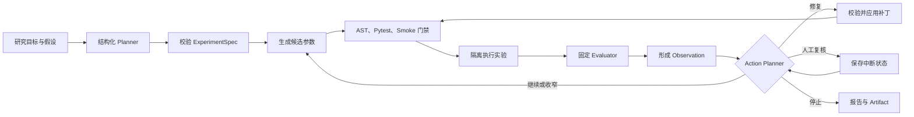

# AutoExp


<p align="center">
  <a href="https://github.com/HeZhongTian-xjtu/AutoExp/blob/main/README.en.md">English</a> |
  <a href="https://github.com/HeZhongTian-xjtu/AutoExp/blob/main/README.md">中文</a>
</p>

> 一个可规划、可执行、可迭代、可追溯的机器学习实验 Agent。


AutoExp 将研究目标和实验假设转化为一条受约束的机器学习实验闭环：LLM 先生成结构化方案，LangGraph 根据实验结果安排下一步动作，执行器完成训练，固定评估器给出指标，系统再决定继续搜索、收窄范围、修复代码、停止运行或交由人工复核。

它并不是把一次模型调用包装成 `train.py` 生成器。AutoExp 把 LLM 擅长的方案提出和结果判断，与系统负责的参数校验、资源限制、代码门禁、指标计算和状态保存分开，让每次实验都有据可查，也能在相同条件下复现。

## 核心能力

- **LangGraph 状态流：** 节点职责、条件路由、检查点、断点续跑和人工复核均有明确状态。
- **结构化规划：** Planner 输出经过 Pydantic 校验的 `ExperimentSpec`，包含目标、假设、指标、预算和初始参数。
- **闭环优化：** 每个 Trial 结束后，Action Planner 可选择继续、缩小搜索范围、修复、停止或请求人工处理。
- **受控代码修复：** LLM 只能提交白名单内的 Unified Diff；补丁必须依次通过上下文、AST/依赖、Pytest 和 Smoke 检查。
- **隔离执行：** LocalExecutor 适合可信代码调试；DockerExecutor 负责网络、权限、CPU、内存、PID 和超时限制。
- **固定评估：** 指标和 Evaluator 由模板定义，数据集使用 SHA-256 标识，训练代码不能自行改写成功标准。
- **实验留痕：** SQLite 保存 Run、Trial、决策和事件，Artifact Store 保存报告、日志、补丁、预测和评估结果。
- **统一内核：** 网页、CLI、FastAPI 和 RQ Worker 都通过 `AutoExpApplicationService` 进入同一条 LangGraph 流程。
- **可选集成：** 支持 OpenAI 兼容模型接口、MLflow、Redis/RQ 后台任务和 SSE 进度事件。

## 运行流程



每次 Run 都受 Trial 数、总时长、单 Trial 超时、Repair 次数、模板参数策略和执行器资源上限约束。状态变化会写入 LangGraph 检查点和事件时间线。

## 系统架构

```text
Streamlit / CLI / FastAPI / RQ Worker
                  |
                  v
       AutoExpApplicationService
                  |
                  v
       LangGraph Experiment Agent
        /          |           \
   Planner     TrialRunner    Reporting
                  |
       Preflight -> Executor -> Evaluator
                  |
       SQLite / Artifacts / MLflow
```

| 模块 | 职责 |
| --- | --- |
| `autoexp/application` | 应用服务、模板与数据集目录、运行时组装和 Trial 协调 |
| `autoexp/domain` | 实验、动作、观测、Run、Trial、数据集和 Repair 的稳定数据契约 |
| `autoexp/graph` | LangGraph 状态、节点、路由、检查点、恢复和人工中断 |
| `autoexp/planning` | 初始 Planner、Action Planner、候选策略和确定性回退 |
| `autoexp/preflight`, `autoexp/validation` | 静态检查与 AST -> Pytest -> Smoke 门禁 |
| `autoexp/execution`, `autoexp/evaluation` | Local/Docker 执行、数据完整性、固定指标和 Evaluator |
| `autoexp/persistence`, `autoexp/tracking` | SQLite、内容寻址 Artifact 和可选 MLflow 追踪 |
| `autoexp/repair`, `autoexp/reporting` | 修复上下文、补丁校验、确定性报告和可选 AI 摘要 |
| `autoexp/server`, `autoexp/webui` | FastAPI/RQ/SSE 服务和 Streamlit 页面 |

## 快速开始

### 环境要求

- Python 3.10 或 3.11
- 需要隔离执行时安装 Docker Desktop 或 Docker Engine
- 使用 LLM Planner、AI 摘要或 LLM Repair 时准备 OpenAI 兼容 API Key
- 只有启用后台任务时才需要 Redis

### 安装

```powershell
git clone https://github.com/HeZhongTian-xjtu/AutoExp.git
cd AutoExp
py -3.10 -m venv .venv
.\.venv\Scripts\python.exe -m pip install --upgrade pip
.\.venv\Scripts\python.exe -m pip install -r requirements.txt
```

Linux 或 macOS 用户可创建 Python 3.10+ 虚拟环境，并把后续命令中的 Windows Python 路径替换为 `python`。

### 启动网页端

```powershell
.\.venv\Scripts\python.exe -m streamlit run autoexp\webui\app.py
```

浏览器打开 `http://localhost:8501`。选择实验模板后，在 Dataset 区域上传并注册兼容的 `train.csv`。Local 模式仅建议用于可信代码的本地调试。

如需使用 Docker 隔离 Trial，请先构建 Runner 镜像：

```powershell
docker build -f Dockerfile.autoexp -t autoexp-runner:latest .
```

### 使用 CLI

数据集在网页端注册后，可通过其 Dataset ID 调用同一套执行内核：

```powershell
.\.venv\Scripts\python.exe scripts\run_autoexp_demo.py `
  --template housing-regression-v1 `
  --dataset-id YOUR_DATASET_ID `
  --planner deterministic `
  --executor local `
  --tracker none `
  --trials 2
```

将参数改为 `--planner llm --executor docker`，即可使用 LLM 规划并在 Docker 中执行。CLI 与网页端共用服务层、状态流、持久化模型和 Evaluator。

### 启动完整服务栈

```powershell
Copy-Item .env.example .env
docker build -f Dockerfile.autoexp -t autoexp-runner:latest .
docker compose up -d --build
.\.venv\Scripts\python.exe -m autoexp.server.worker
```

| 服务 | 地址 |
| --- | --- |
| Streamlit | `http://localhost:8501` |
| FastAPI | `http://localhost:8000` |
| MLflow | `http://localhost:5000` |
| Redis | `localhost:6379` |

RQ Worker 需要访问 Docker，只应运行在可信主机上。当前 Compose 配置用于本地联调，不是可直接暴露到公网的生产方案。

## 模型配置

复制 `.env.example`，填写 OpenAI 兼容接口：

```dotenv
OPENAI_API_KEY=your-api-key
OPENAI_BASE_URL=https://api.deepseek.com
AUTOEXP_PLANNER_MODEL=deepseek-v4-flash
```

AutoExp 通过 OpenAI SDK 协议调用模型，可接入 OpenAI、DeepSeek 及兼容网关。`.env` 已被 Git 忽略，请勿提交任何真实密钥。

常用运行变量包括：

| 变量 | 作用 |
| --- | --- |
| `AUTOEXP_PLANNER_MODE` | 选择 `deterministic`、`llm` 或 `auto` Planner |
| `AUTOEXP_EXECUTOR` | 选择 `local` 或 `docker` 执行器 |
| `AUTOEXP_TRACKER` | 关闭追踪或使用 `mlflow` |
| `AUTOEXP_DB_PATH` | SQLite 运行数据库 |
| `AUTOEXP_ARTIFACT_ROOT` | Artifact 保存目录 |
| `AUTOEXP_API_TOKEN` | FastAPI 可选 Bearer Token |

## 任务与数据

实验模板负责定义参数空间、较弱基线、可修改文件、资源限制、验证命令、指标和 Evaluator。

| 模板 | 数据来源 | 目标列 | 指标 |
| --- | --- | --- | --- |
| `housing-regression-v1` | [Kaggle House Prices](https://www.kaggle.com/competitions/house-prices-advanced-regression-techniques/data) | `SalePrice` | RMSE-log，越低越好 |
| `covertype-classification-v1` | [UCI Covertype](https://archive.ics.uci.edu/dataset/31/covertype) | `Cover_Type` | Macro-F1，越高越好 |
| `bank-marketing-classification-v1` | [UCI Bank Marketing](https://archive.ics.uci.edu/dataset/222/bank%2Bmarketing) | `y` | AP，越高越好 |
| `online-shoppers-classification-v1` | [UCI Online Shoppers](https://archive.ics.uci.edu/dataset/468/online%20shoppers%20purchasing%20intention%20dataset) | `Revenue` | AP，越高越好 |
| `text-classification-v1` | 用户自备的兼容性数据 | `text`, `label` | Macro-F1，越高越好 |

仓库只提供模板契约和数据来源说明，不重新分发第三方数据。请从原始来源合法获取数据，遵守对应许可或竞赛规则，再上传兼容文件。上述 UCI 数据集采用 CC BY 4.0；Kaggle 数据仍受数据页面和竞赛条款约束。

上传完成后，系统会检查文件并生成 SHA-256 标识，数据保存在 `workspaces/datasets/`。原始数据、运行数据库、日志、检查点和 Artifact 均不会进入 Git。

## Agent 评估

评估选用 Housing、Covertype、Bank Marketing 和 Online Shoppers 四个正式任务，在相同的参数空间、较弱基线和五个随机种子（`42`-`46`）下比较 Random Search、Optuna 与 AutoExp LLM。Text Classification 不参与正式评估；Code Repair 关闭，因此结果只反映参数优化能力。每种 Trial 预算包含 60 个 Run，全部成功完成。

<table>
  <thead>
    <tr>
      <th rowspan="2">方法</th>
      <th colspan="2">胜场</th>
      <th colspan="2">平均排名</th>
      <th colspan="2">平均耗时</th>
    </tr>
    <tr>
      <th>2 Trials</th>
      <th>6 Trials</th>
      <th>2 Trials</th>
      <th>6 Trials</th>
      <th>2 Trials</th>
      <th>6 Trials</th>
    </tr>
  </thead>
  <tbody>
    <tr>
      <td>Random</td>
      <td>5/20（25%）</td>
      <td>4/20（20%）</td>
      <td>2.40</td>
      <td>2.30</td>
      <td>21.36 秒</td>
      <td>74.02 秒</td>
    </tr>
    <tr>
      <td>Optuna</td>
      <td>7/20（35%）</td>
      <td>5/20（25%）</td>
      <td>1.80</td>
      <td>2.05</td>
      <td>22.70 秒</td>
      <td>76.62 秒</td>
    </tr>
    <tr>
      <td>AutoExp LLM</td>
      <td><strong>8/20（40%）</strong></td>
      <td><strong>11/20（55%）</strong></td>
      <td><strong>1.80</strong></td>
      <td><strong>1.65</strong></td>
      <td>28.57 秒</td>
      <td>137.33 秒</td>
    </tr>
  </tbody>
</table>

2-Trial 任务结果（`均值 ± 样本标准差`）：

| 任务 | Random | Optuna | AutoExp LLM | 最佳 |
| --- | ---: | ---: | ---: | --- |
| Housing，RMSE 越低越好 | 0.2459 ± 0.1046 | 0.1958 ± 0.1094 | **0.1345 ± 0.0114** | AutoExp |
| Covertype，Macro-F1 越高越好 | 0.6932 ± 0.1781 | **0.7646 ± 0.0832** | 0.6972 ± 0.1931 | Optuna |
| Bank Marketing，AP 越高越好 | 0.5334 ± 0.0140 | 0.5369 ± 0.0099 | **0.5389 ± 0.0083** | AutoExp |
| Online Shoppers，AP 越高越好 | 0.6403 ± 0.0214 | 0.6430 ± 0.0224 | **0.6453 ± 0.0235** | AutoExp |

6-Trial 任务结果：

| 任务 | Random | Optuna | AutoExp LLM |
| --- | ---: | ---: | ---: |
| Housing，RMSE 越低越好 | 0.1522 ± 0.0246 | 0.1456 ± 0.0333 | **0.1298 ± 0.0107** |
| Covertype，Macro-F1 越高越好 | 0.8120 ± 0.0223 | 0.8322 ± 0.0275 | **0.8536 ± 0.0051** |
| Bank Marketing，AP 越高越好 | 0.5406 ± 0.0055 | 0.5410 ± 0.0055 | **0.5411 ± 0.0055** |
| Online Shoppers，AP 越高越好 | **0.6459 ± 0.0236** | 0.6457 ± 0.0234 | 0.6457 ± 0.0233 |

当每次 Run 只有 2 个 Trial 时，三种策略都容易受到有利采样影响。预算增加到 6 个 Trial 后，AutoExp 的配对胜率提升到 55%，优势主要体现在 Housing 和 Covertype；Bank Marketing 与 Online Shoppers 的结果仍非常接近。LLM 策略的耗时也更高，因此这组结果说明的是效果与成本之间的权衡，而不是对其他方法的全面碾压。

以上表格保留的是四任务评估快照。准备好本地数据后，仓库内的正式脚本可以复现已注册的三个 Phase 1 任务：Housing、Covertype 和 Bank Marketing。

```powershell
.\.venv\Scripts\python.exe scripts\run_optimization_benchmark.py `
  --all-tasks `
  --policies random optuna llm `
  --seeds 42 43 44 45 46 `
  --trials 6 `
  --output workspaces\benchmarks-6
```

## 隔离与安全

AutoExp 始终把生成代码视为不可信输入：

- 模板清单限定可修改文件、依赖、指标、参数策略和资源上限；
- 模型输出必须先通过结构化 Schema 校验；
- Repair 补丁必须匹配当前源码，并通过完整门禁；
- Docker Trial 默认断网、移除 API Key、使用非 root 用户和只读根文件系统，同时限制资源；
- 固定 Evaluator 与数据集哈希保证训练代码无法改变评判标准；
- 重复错误和重复补丁会终止自动修复，并可转入人工复核。

这些措施能降低风险，但当前版本仍不适合直接承载不可信用户的多租户公网执行。漏洞报告和部署注意事项见 [SECURITY.md](SECURITY.md)。

## 项目结构

```text
autoexp/                 应用服务、状态流、规划、执行和服务端代码
experiment_templates/    版本化任务清单、训练代码和 Evaluator
repair_benchmarks/       受控 Code Repair 故障样例
scripts/                 CLI、数据准备和可复现实验脚本
docs/assets/             README 演示素材
workspaces/              本地 Run、数据集、数据库和 Artifact（Git 忽略）
```

## 开发与扩展

```powershell
.\.venv\Scripts\python.exe -m pip install -e ".[dev]"
.\.venv\Scripts\ruff.exe check autoexp scripts
.\.venv\Scripts\black.exe --check autoexp scripts
```

新增实验模板时，应同时提供 Manifest、较弱基线、有边界的参数策略、固定 Evaluator、验证命令和资源策略。新增用户功能应优先接入 `AutoExpApplicationService`，确保网页、CLI、API 和 Worker 行为一致。

## 适用范围

AutoExp 目前处于 Alpha 阶段，适合本地机器学习实验研究和工程演示，重点是受控的表格任务优化。它不是通用 AutoML 平台、多租户在线服务，也不包含文献检索或 RAG。正式公开部署仍需补充认证、TLS、网络策略、密钥管理、可观测性和主机级配额。

## 参与贡献

欢迎提交 Issue 和 Pull Request。问题报告请附上模板、Planner/Executor/Tracker 模式、操作系统、复现命令、Run 状态和脱敏日志。请勿上传 API Key、私有数据集或敏感源码。

## 许可证

AutoExp 使用 [MIT License](LICENSE) 开源。
