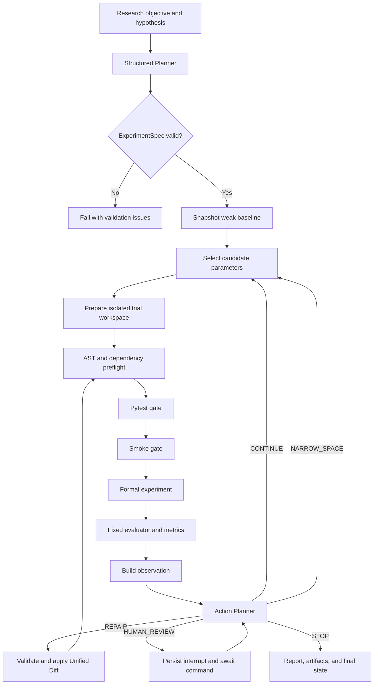
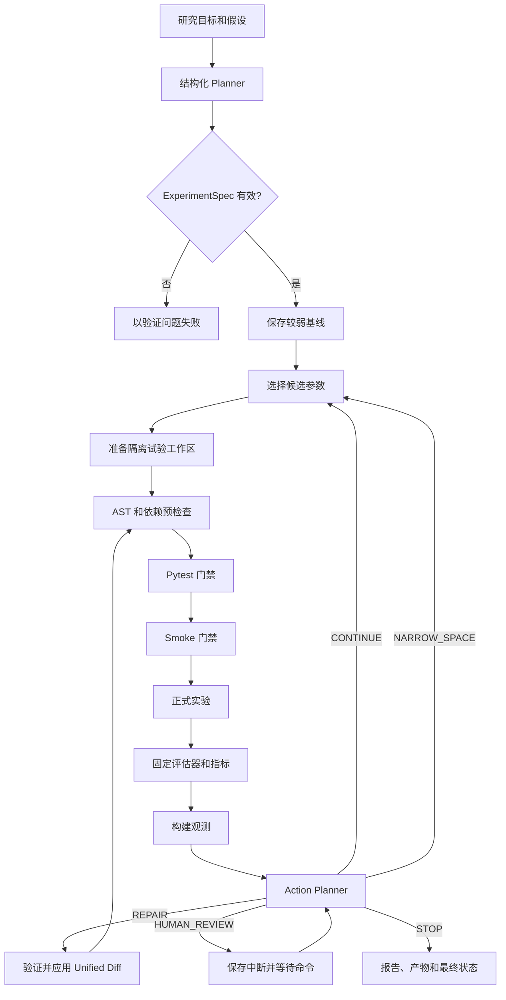

# AutoExp

<p align="center">
  <a href="#english-documentation">English</a> |
  <a href="README.zh-CN.md">中文</a>
</p>


<a id="english-documentation"></a>
<details>
<summary><strong>English Documentation (default)</strong></summary>

> A controlled autonomous machine-learning experiment agent built for transparent, reproducible, and inspectable optimization.

## Demo


AutoExp turns a research objective and hypothesis into a bounded machine-learning experiment loop. An LLM or deterministic planner produces a structured experiment specification, the system validates it against a registered template, executes controlled trials, evaluates fixed metrics, and lets an action planner decide whether to continue, narrow the search space, repair code, stop, or request human review.

The project is designed as an engineering and research portfolio project. Its focus is not unrestricted code generation; its focus is making Agent decisions, code changes, experiment state, metrics, failures, and artifacts explicit and auditable.

**Current status:** the local Web/CLI workflow, LangGraph state machine, SQLite persistence, Docker trial isolation, Repair gates, MLflow integration, background-task API, and reproducible optimization benchmarks are implemented. Public deployment hardening remains intentionally out of scope for the current release.

## Why AutoExp

A useful experiment agent needs more than an LLM call followed by `python train.py`. AutoExp separates probabilistic model decisions from deterministic enforcement:

| LLM or policy component | Deterministic system boundary |
| --- | --- |
| Propose an `ExperimentSpec` | Validate it against the template manifest and resource budget |
| Select the next parameters | Reject unknown, duplicated, or out-of-policy values |
| Propose a Unified Diff repair | Enforce file allowlists, patch context, AST, dependency, Pytest, and Smoke gates |
| Interpret trial observations | Compute metrics with a fixed evaluator and immutable dataset identity |
| Generate a human-readable summary | Persist the complete run, decisions, failures, and artifacts independently |

This boundary makes the result reproducible enough for comparison while still demonstrating structured LLM planning, function-style outputs, stateful Agent control, automatic experimentation, and code repair.

## Highlights

- **LangGraph orchestration** with explicit nodes, conditional routing, SQLite checkpoints, resume, and human-review interrupts.
- **Structured planning** that converts an objective and hypothesis into a validated Pydantic `ExperimentSpec`.
- **Result-conditioned actions**: `CONTINUE`, `NARROW_SPACE`, `REPAIR`, `STOP`, and `HUMAN_REVIEW`.
- **Controlled Code Agent** that collects failure context, generates allowlisted Unified Diff patches, rejects duplicate failures, and preserves Repair artifacts.
- **Execution gates** in the order `AST/dependency -> Pytest -> Smoke -> formal experiment`.
- **Local and Docker executors** behind one execution protocol.
- **Docker isolation** with no network, non-root execution, read-only container root, dropped capabilities, CPU/memory/PID limits, and immutable file mounts.
- **Dataset registry** for uploaded datasets, compatibility checks, SHA-256 identity, local previews, and immutable staging.
- **SQLite and artifact persistence** for runs, trials, decisions, events, reports, patches, logs, and resumable state.
- **Optional MLflow tracking** with an aggregate parent run and per-trial child runs; SQLite remains authoritative.
- **Unified Web and CLI core** through `AutoExpApplicationService` and the same LangGraph workflow.
- **FastAPI + Redis/RQ + SSE control plane** for queued long-running experiments and progress events.
- **Reproducible benchmarks** for Random, Optuna, and LLM parameter policies, plus controlled Repair cases.
- **Deterministic report and optional AI Run Summary** without hiding the underlying trial details.

## Workflow



A run is bounded by maximum trials, per-trial timeout, total elapsed time, Repair count, template parameter policy, and executor resource limits. Every transition is represented in persisted graph state or the run event timeline.

## Architecture

The LangGraph workflow is the canonical execution path. Streamlit, CLI, FastAPI, and the RQ worker all enter through the same application service.

```text
Web / CLI / API / Worker
        |
        v
AutoExpApplicationService
        |
        +-- Planner and Action Planner
        +-- LangGraphExperimentOrchestrator
        |       +-- graph state and checkpoints
        |       +-- budget and action routing
        |       +-- Repair and human review
        |
        +-- TrialRunner
        |       +-- preflight and validation gates
        |       +-- LocalExecutor / DockerExecutor
        |       +-- fixed evaluator and metrics
        |
        +-- SQLiteRepository / ArtifactStore / MLflowTracker
        +-- ReportBuilder / optional RunSummaryGenerator
```

| Package | Responsibility |
| --- | --- |
| `autoexp/domain` | Experiment, action, observation, run, trial, dataset, Repair, and validation contracts |
| `autoexp/application` | Application service, template/dataset catalogs, shared runtime mechanics, and trial coordination |
| `autoexp/graph` | LangGraph nodes, state snapshots, routing, resume, Repair, and human interrupts |
| `autoexp/planning` | Deterministic and LLM planners, Action Planner, policy fallback |
| `autoexp/preflight`, `autoexp/validation` | AST/dependency checks and Pytest/Smoke gate pipeline |
| `autoexp/execution` | Local and resource-limited Docker execution |
| `autoexp/evaluation` | Dataset integrity, profiling, fixed metrics, and evaluator contracts |
| `autoexp/persistence` | SQLite repository and content-addressed run artifacts |
| `autoexp/tracking` | Optional MLflow tracking and failure spool |
| `autoexp/reporting` | Deterministic report and optional AI Run Summary |
| `autoexp/server` | FastAPI, task store, Redis/RQ worker, cancellation, and SSE |
| `autoexp/webui` | Streamlit setup, progress, history, run details, and dataset management |

The former imperative orchestrator is retained only as a compatibility implementation. New user-facing code should call `AutoExpApplicationService`; new persisted models should be imported from `autoexp.domain`.

## Quick Start

### Requirements

- Python 3.10 or 3.11
- Docker Desktop or Docker Engine for isolated execution
- An OpenAI-compatible API key only when using the LLM planner, LLM Action Planner, AI Summary, or LLM Repair
- Redis only when using background tasks

### Install

Windows PowerShell:

```powershell
py -3.10 -m venv .venv
.\.venv\Scripts\python.exe -m pip install --upgrade pip
.\.venv\Scripts\python.exe -m pip install -r requirements.txt
```

Linux or macOS:

```bash
python3.10 -m venv .venv
source .venv/bin/activate
python -m pip install --upgrade pip
python -m pip install -r requirements.txt
```

`requirements.txt` is the single maintained dependency manifest for the core runtime, Web/API services, OpenAI-compatible integrations, Redis/RQ, Optuna, and MLflow.

### Run an offline experiment

No API key is required for deterministic planning:

```powershell
.\.venv\Scripts\python.exe scripts\run_autoexp_demo.py `
  --template housing-regression-v1 `
  --planner deterministic `
  --executor local `
  --tracker none `
  --trials 2
```

The command prints the structured run summary and writes runtime data under `workspaces/`.

### Start the Web UI

```powershell
.\.venv\Scripts\python.exe -m streamlit run autoexp\webui\app.py
```

Open `http://localhost:8501`. The UI provides experiment configuration, template and dataset selection, trial progress, history, complete run details, artifacts, reports, and an optional AI Run Summary.

The UI defaults to Docker execution and MLflow tracking unless overridden by environment variables. Build the runner image and start Docker before using those defaults, or select Local/SQLite-only for development.

## LLM Configuration

Copy the example environment file and fill in your own secret:

```powershell
Copy-Item .env.example .env
```

```dotenv
OPENAI_API_KEY=your-api-key
OPENAI_BASE_URL=https://api.deepseek.com
AUTOEXP_PLANNER_MODEL=deepseek-v4-flash
```

AutoExp uses the OpenAI SDK contract, so OpenAI, DeepSeek, and compatible relay endpoints can be configured through the same variables. `.env` is ignored by Git and must never be committed.

Run the LLM planner with isolated execution:

```powershell
docker build -f Dockerfile.autoexp -t autoexp-runner:latest .

.\.venv\Scripts\python.exe scripts\run_autoexp_demo.py `
  --template housing-regression-v1 `
  --planner llm `
  --executor docker `
  --tracker mlflow `
  --trials 3
```

Important configuration variables:

| Variable | Purpose | Default |
| --- | --- | --- |
| `OPENAI_API_KEY` | OpenAI-compatible provider secret | unset |
| `OPENAI_BASE_URL` | Provider base URL | provider SDK default |
| `AUTOEXP_PLANNER_MODEL` | Planner, Action Planner, and Repair model | `deepseek-v4-flash` |
| `AUTOEXP_REPORT_MODEL` | Optional AI Summary model | planner model |
| `AUTOEXP_PLANNER_MODE` | `deterministic`, `llm`, or `auto` | `deterministic` |
| `AUTOEXP_EXECUTOR` | `local` or `docker` | `local` in the service factory |
| `AUTOEXP_DOCKER_IMAGE` | Trial runner image | `autoexp-runner:latest` |
| `AUTOEXP_TRACKER` | `none` or `mlflow` | `none` in the service factory |
| `AUTOEXP_DB_PATH` | Run SQLite database | `workspaces/autoexp.sqlite3` |
| `AUTOEXP_ARTIFACT_ROOT` | Artifact directory | `workspaces/autoexp-artifacts` |
| `AUTOEXP_CHECKPOINT_DB_PATH` | LangGraph checkpoint database | derived from the run database |
| `MLFLOW_TRACKING_URI` | MLflow backend | `sqlite:///./workspaces/mlflow.db` |
| `AUTOEXP_API_TOKEN` | Optional bearer token for the FastAPI control plane | unset |
| `AUTOEXP_MAX_CONCURRENT_RUNS` | Queue admission limit | `2` |
| `AUTOEXP_JOB_TIMEOUT` | RQ job timeout in seconds | `3600` |
| `AUTOEXP_REDIS_URL` | Redis connection URL | `redis://localhost:6379/0` |

## Experiment Templates and Datasets

Templates are versioned experiment contracts. Each template owns its parameter policy, weak baseline, resource limits, mutable/immutable files, validation commands, fixed evaluator, metric direction, and dataset compatibility rules.

| Template ID | Task contract | Dataset ID | Metric | Direction |
| --- | --- | --- | --- | --- |
| `housing-regression-v1` | Ames house-price regression | `ames-house-prices-v1` | `rmse_log` | minimize |
| `covertype-classification-v1` | Seven-class forest cover prediction | `covertype-v1` | `macro_f1` | maximize |
| `bank-marketing-classification-v1` | Term-deposit response prediction | `bank-marketing-v1` | `average_precision` | maximize |
| `online-shoppers-classification-v1` | Purchase-intention prediction | `online-shoppers-v1` | `average_precision` | maximize |
| `text-classification-v1` | Small compatibility text demo | `embedded-text-v1` | `macro_f1` | maximize |

The first three templates form the fixed Phase 1 optimization benchmark. Online Shoppers is an additional challenge task. Text Classification is retained as a small compatibility task and should not be presented as a full-scale deep-learning experiment.

### Dataset use and upload policy

The public repository does not distribute third-party dataset files. Every run
uses a dataset registered through the Dataset Catalog upload flow. This keeps
the repository small, avoids silently redistributing competition data, and
allows users to accept the source terms that apply to the copy they use.

AutoExp uses uploaded datasets only as local inputs for the selected machine-
learning benchmark and fixed evaluator. The project does not claim ownership
of third-party data. Users are responsible for obtaining the data lawfully,
following the source terms, and preserving the required attribution.

### Dataset provenance

The table below records the official source, licensing context, and upload
contract for every supported dataset. Source links document provenance; they
do not replace the source terms or permission requirements.

| Dataset ID | Official source | License / terms | Local representation |
| --- | --- | --- | --- |
| `ames-house-prices-v1` | [Kaggle House Prices competition](https://www.kaggle.com/competitions/house-prices-advanced-regression-techniques/data) | MIT is listed on the data page; review the competition rules before redistribution | Upload `train.csv` with `Id` and `SalePrice`; optional `test.csv` |
| `bank-marketing-v1` | [UCI Bank Marketing](https://archive.ics.uci.edu/dataset/222/bank%2Bmarketing) | [CC BY 4.0](https://creativecommons.org/licenses/by/4.0/) | Upload `train.csv` with target column `y` and preserve UCI attribution |
| `covertype-v1` | [UCI Covertype](https://archive.ics.uci.edu/dataset/31/covertype) | [CC BY 4.0](https://creativecommons.org/licenses/by/4.0/) | Upload `train.csv` with target column `Cover_Type` and preserve UCI attribution |
| `online-shoppers-v1` | [UCI Online Shoppers Purchasing Intention](https://archive.ics.uci.edu/dataset/468/online%20shoppers%20purchasing%20intention%20dataset) | [CC BY 4.0](https://creativecommons.org/licenses/by/4.0/) | Upload `train.csv` with target column `Revenue` and preserve UCI attribution |
| `embedded-text-v1` | Repository-generated compatibility task | AutoExp MIT license | Upload `train.csv` with `text` and `label` columns |

After upload, AutoExp writes a manifest containing the dataset ID, row count,
and SHA-256 identity. Registered copies are stored below `workspaces/datasets/`
and are intentionally ignored by Git.

### Dataset layout

```text
datasets/
  sources/                       # optional maintainer-only downloads; ignored by Git
    bank_marketing/
    covertype/
    online_shoppers/
  builtin/                       # optional maintainer-only normalized assets; ignored by Git
    bank-marketing-v1/data/
    covertype-v1/data/
    online-shoppers-v1/data/

experiment_templates/
  */data/                        # optional local fixtures; ignored by public Git

workspaces/
  datasets/                      # validated uploaded datasets
  ...                            # runs, databases, checkpoints, and artifacts
```

Maintainers may prepare local challenge datasets after placing source archives
under `datasets/sources/`; these files are not part of the public release:

```powershell
.\.venv\Scripts\python.exe scripts\prepare_challenging_datasets.py
```

The preparation script writes normalized CSV files and a manifest containing
the dataset ID, row count, and SHA-256 identity. Generated datasets, uploads,
experiment outputs, databases, API keys, and logs are intentionally excluded
from Git.

## CLI Reference

List all options:

```powershell
.\.venv\Scripts\python.exe scripts\run_autoexp_demo.py --help
```

Useful examples:

```powershell
# Select a registered uploaded dataset
.\.venv\Scripts\python.exe scripts\run_autoexp_demo.py `
  --template housing-regression-v1 `
  --dataset-id my-dataset-id `
  --planner deterministic

# Store one demonstration in isolated paths
.\.venv\Scripts\python.exe scripts\run_autoexp_demo.py `
  --template bank-marketing-classification-v1 `
  --db workspaces/demo.sqlite3 `
  --artifact-root workspaces/demo-artifacts `
  --output workspaces/demo-run

# Resume a persisted run
.\.venv\Scripts\python.exe scripts\run_autoexp_demo.py `
  --template housing-regression-v1 `
  --resume RUN_ID
```

CLI and Web use the same application service, persisted run model, planners, executors, and LangGraph core. Different outcomes should come from configuration or provider behavior, not from separate orchestration implementations.

## Docker and Background Tasks

### Isolated trial runner

Build the execution image:

```powershell
docker build -f Dockerfile.autoexp -t autoexp-runner:latest .
```

`DockerExecutor` creates a disposable container for each gate or experiment process with:

- network disabled by default;
- a non-root user;
- a read-only root filesystem and bounded temporary filesystem;
- all Linux capabilities dropped and `no-new-privileges` enabled;
- CPU, memory, PID, and timeout limits;
- immutable template and dataset files mounted read-only;
- a small allowlist of child-process environment variables.

The LocalExecutor is intended for trusted development and tests. Use Docker for generated or repaired code.

### Web/API stack

Start Streamlit, FastAPI, Redis, and MLflow infrastructure:

```powershell
docker compose up -d --build
```

Start the RQ worker on a trusted host that has Docker access:

```powershell
.\.venv\Scripts\python.exe -m autoexp.server.worker
```

Services:

| Service | URL | Responsibility |
| --- | --- | --- |
| Streamlit | `http://localhost:8501` | Interactive experiment UI |
| FastAPI | `http://localhost:8000` | Run creation, status, cancellation, and SSE |
| MLflow | `http://localhost:5000` | Optional experiment comparison UI |
| Redis | `localhost:6379` | RQ queue transport |

The API exposes `POST /api/runs`, `GET /api/runs`, `GET /api/runs/{run_id}`, `POST /api/runs/{run_id}/cancel`, and `GET /api/runs/{run_id}/events`. Set `AUTOEXP_API_TOKEN` before exposing the service beyond localhost.

The worker is intentionally separate from the Web/API containers so only the trusted worker needs Docker Engine access. The current Compose setup is for local demonstration, not an internet-facing production deployment.

## Reproducible Benchmarks

### Optimization policies

Compare Random, Optuna, and LLM policies with the same registered search space, weak baseline, seed set, and trial budget:

```powershell
.\.venv\Scripts\python.exe scripts\run_optimization_benchmark.py `
  --template housing-regression-v1 `
  --policies random optuna llm `
  --seeds 42 43 44 `
  --trials 5
```

Use `--all-tasks` for all Phase 1 tasks and `--list-tasks` to inspect the catalog. The default comparison is parameter-only: LLM Repair and source context are disabled for fairness. Code optimization must be enabled explicitly with `--allow-code-optimization` and reported as a different experiment scope.

Benchmark outputs are written below `workspaces/benchmarks/` as machine-readable JSON and Markdown summaries. They include the baseline, parameter trajectory, best metric, improvement direction, elapsed time, successful/failed trials, dataset identity, and policy metadata.

### Controlled Repair benchmark

Prepare a failure case without calling an external model:

```powershell
.\.venv\Scripts\python.exe scripts\run_repair_benchmark.py wrong-target-column
```

Validate a saved structured repair:

```powershell
.\.venv\Scripts\python.exe scripts\run_repair_benchmark.py `
  wrong-target-column `
  --repair RepairSpec.json `
  --executor docker
```

A real LLM Repair sends the controlled fixture source and failure logs to the configured provider. It therefore requires explicit authorization:

```powershell
.\.venv\Scripts\python.exe scripts\run_repair_benchmark.py `
  wrong-target-column `
  --llm `
  --allow-source-egress `
  --executor docker
```

A Repair is successful only when its patch passes the file allowlist, context checks, AST/dependency preflight, Pytest, Smoke, and final validation. API success alone is not counted as Repair success.

## Persistence, Tracking, and Reports

SQLite is the source of truth for run history and Agent state. LangGraph checkpoints are stored separately so an interrupted or human-reviewed run can resume without repeating completed trials.

A run may persist:

- the generated `ExperimentSpec` and planner metadata;
- weak-baseline snapshot and code digest;
- trial parameters, metrics, gate results, execution metadata, and failures;
- observations and Action Planner decisions;
- patches, Repair validation, logs, predictions, and evaluator outputs;
- deterministic Markdown report and optional AI Run Summary;
- timeline events and human-review state.

MLflow is a best-effort comparison view. Tracking failures do not invalidate the SQLite run; failed tracking operations are written to a local spool when possible.

Runtime output belongs under `workspaces/` and is ignored by Git. Do not commit local databases, checkpoints, generated reports, raw datasets, model-provider payloads, or experiment artifacts.

## Safety Model

AutoExp treats generated code as untrusted input.

- A template manifest defines mutable files, immutable files, allowed imports, allowed models, parameter policy, metric contract, and resource limits.
- LLM-proposed values and patches are parsed into structured schemas before use.
- Repair may only target allowlisted files and must match the current source context.
- Repeated failure fingerprints and duplicate rejected patches stop automatic Repair.
- Fixed evaluators and immutable dataset manifests prevent generated training code from redefining success.
- Docker execution removes network access and API keys from the trial environment.
- Human review is a persisted state, not an exception that silently restarts the loop.
- External Repair requires a separate source-egress authorization flag.

These controls reduce risk; they do not make arbitrary generated code safe on an untrusted public service. Keep the worker private, restrict Docker access, require API authentication, and apply infrastructure-level quotas before any public deployment.

## Repository Layout

```text
autoexp/
  application/                 application service and trial coordination
  benchmark/                   optimization and Repair benchmarks
  domain/                      stable experiment contracts
  evaluation/                  dataset integrity, profiles, and metrics
  execution/                   LocalExecutor and DockerExecutor
  graph/                       canonical LangGraph workflow
  llm/                         OpenAI-compatible gateway and tool schema
  persistence/                 SQLite and artifact storage
  planning/                    initial Planner and Action Planner
  preflight/                   AST and dependency checks
  repair/                      context collection and Unified Diff handling
  reporting/                   deterministic and AI reports
  server/                      FastAPI, task store, RQ worker, and SSE
  tracking/                    MLflow integration
  validation/                  Pytest and Smoke gates
  webui/                       Streamlit application

experiment_templates/          versioned tasks, manifests, tests, and evaluators
repair_benchmarks/              controlled code-failure fixtures
scripts/                        CLI, dataset preparation, and formal benchmarks
tests/                          local maintainer validation; excluded from public Git
datasets/                       local raw and normalized challenge data; ignored
workspaces/                     databases, checkpoints, runs, and artifacts; ignored
```

`input/` is a historical local fixture and is not part of the AutoExp runtime contract. New data should enter through the Dataset Catalog or the `datasets/` preparation flow.

## Development

The public repository intentionally excludes maintainer test source, `pytest.ini`,
and the Pytest workflow. The local development copy may retain additional Pytest
coverage, while public release checks use linting, package builds, documented
Smoke/Benchmark commands, and the Docker validation path.

Build and validate a release artifact locally:

```powershell
.\.venv\Scripts\python.exe -m build
.\.venv\Scripts\python.exe -m twine check dist/*
```

Run the same style checks used by CI:

```powershell
.\.venv\Scripts\python.exe -m pip install ruff==0.7.1 black==24.3.0
.\.venv\Scripts\ruff.exe check autoexp scripts
.\.venv\Scripts\black.exe --check autoexp scripts
```

When adding a feature:

1. Add or update the stable contract in `autoexp/domain`.
2. Put deterministic mechanics in the owning package.
3. Use LangGraph nodes only for workflow decisions and state transitions.
4. Expose the capability through `AutoExpApplicationService` before adding UI code.
5. Add focused local validation for changed behavior; test-only source is excluded from public Git.
6. Keep generated outputs, data, secrets, and local state out of Git.

When adding a template, provide a manifest, weak baseline, bounded parameter policy, fixed evaluator, Smoke test, template tests, resource policy, and immutable dataset contract.

## Current Scope and Limitations

AutoExp is ready as a local portfolio and research demonstration, but it is not yet a general-purpose AutoML platform or a production multi-tenant service.

- Dataset files are upload-only in the public release; the repository distributes contracts and provenance, not third-party data.
- LLM behavior, cost, latency, and availability depend on the configured provider.
- The deterministic planner is an offline fallback and comparison baseline, not a substitute for LLM reasoning evidence.
- Text Classification is a compatibility fixture; use the tabular challenge templates for meaningful optimization demonstrations.
- Background cancellation is persisted, but arbitrary training code may not stop at every possible instruction boundary.
- Docker provides a strong local isolation boundary, but public deployment still needs authentication, TLS, network policy, secret management, observability, and host-level quotas.
- Literature retrieval and RAG are intentionally outside this repository's scope.

## Contributing

Issues and pull requests are welcome. A useful report includes the selected template, planner/executor/tracker modes, operating system, reproduction command, run status, and sanitized logs. Never attach API keys, complete private datasets, or sensitive source code sent to an external provider.

For behavior changes, include tests and explain any changes to schemas, graph routing, template policy, persistence, or executor security.

## License

AutoExp is available under the [MIT License](LICENSE).

</details>

<a id="chinese-documentation"></a>
<details>
<summary><strong>中文文档</strong></summary>

> 一个面向透明、可复现、可检查优化流程的受控自主机器学习实验 Agent。

## 演示


AutoExp 将研究目标和实验假设转换为有边界的机器学习实验循环。LLM 或确定性 Planner 生成结构化实验规格，系统根据已注册的模板验证规格，执行受控试验，使用固定指标评估结果，并让 Action Planner 决定继续搜索、收窄搜索空间、修复代码、停止运行或请求人工复核。

本项目定位为工程与科研方向的作品集项目。重点不是让大模型无约束地生成代码，而是将 Agent 决策、代码修改、实验状态、指标、失败原因和产物显式记录并审计。

**当前状态：** 本地 Web/CLI 流程、LangGraph 状态机、SQLite 持久化、Docker 试验隔离、Repair 门禁、MLflow 集成、后台任务 API 和可复现优化基准已经实现。公开部署加固不属于当前版本的目标范围。

## 为什么选择 AutoExp

一个有用的实验 Agent 不应只是调用 LLM 后执行 `python train.py`。AutoExp 将概率性模型决策与确定性执行边界分离：

| LLM 或策略组件 | 确定性系统边界 |
| --- | --- |
| 提出 `ExperimentSpec` | 根据模板清单和资源预算验证规格 |
| 选择下一组参数 | 拒绝未知、重复或违反策略的值 |
| 提出 Unified Diff 修复 | 执行文件白名单、上下文、AST、依赖、Pytest 和 Smoke 门禁 |
| 解释试验观测 | 使用固定评估器和不可变数据集身份计算指标 |
| 生成面向人的摘要 | 独立持久化完整运行、决策、失败和产物 |

这种边界使结果足够可复现，便于比较，同时展示结构化 LLM 规划、函数式输出、有状态 Agent 控制、自动实验和代码修复能力。

## 核心能力

- **LangGraph 编排**：显式节点、条件路由、SQLite 检查点、断点恢复和人工复核中断。
- **结构化规划**：将目标和假设转换为经过 Pydantic 验证的 `ExperimentSpec`。
- **基于结果的动作**：`CONTINUE`、`NARROW_SPACE`、`REPAIR`、`STOP` 和 `HUMAN_REVIEW`。
- **受控 Code Agent**：收集失败上下文，生成受白名单约束的 Unified Diff，拒绝重复失败并保存 Repair 产物。
- **分层执行门禁**：按 `AST/依赖检查 -> Pytest -> Smoke -> 正式实验` 顺序执行。
- **统一执行协议**：LocalExecutor 和 DockerExecutor 共用同一套执行接口。
- **Docker 隔离**：默认无网络、非 root 用户、只读容器根文件系统、删除 Linux capabilities、CPU/内存/PID 限制，以及只读模板和数据挂载。
- **数据集注册**：支持上传数据集、兼容性检查、SHA-256 身份、本地预览和不可变暂存。
- **SQLite 与产物持久化**：保存运行、试验、决策、事件、报告、补丁、日志和可恢复状态。
- **可选 MLflow 追踪**：提供父运行和每个试验的子运行；SQLite 仍然是权威数据源。
- **统一 Web/CLI 内核**：通过 `AutoExpApplicationService` 和同一套 LangGraph 工作流运行。
- **FastAPI + Redis/RQ + SSE**：支持排队的长任务和进度事件。
- **可复现基准**：支持 Random、Optuna、LLM 参数策略和受控 Repair 案例。
- **统一报告**：提供确定性报告和可选 AI Run Summary，不隐藏底层试验细节。

## 工作流



一次运行受到最大试验次数、单试验超时、总耗时、Repair 次数、模板参数策略和执行器资源限制的约束。每个状态转移都会持久化到图状态或运行事件时间线中。

## 架构

LangGraph 工作流是规范执行路径。Streamlit、CLI、FastAPI 和 RQ Worker 都通过同一个应用服务进入实验内核。

```text
Web / CLI / API / Worker
        |
        v
AutoExpApplicationService
        |
        +-- Planner 和 Action Planner
        +-- LangGraphExperimentOrchestrator
        |       +-- 图状态和检查点
        |       +-- 预算和动作路由
        |       +-- Repair 和人工复核
        |
        +-- TrialRunner
        |       +-- 预检查和验证门禁
        |       +-- LocalExecutor / DockerExecutor
        |       +-- 固定评估器和指标
        |
        +-- SQLiteRepository / ArtifactStore / MLflowTracker
        +-- ReportBuilder / 可选 RunSummaryGenerator
```

| 包 | 职责 |
| --- | --- |
| `autoexp/domain` | 实验、动作、观测、运行、试验、数据集、Repair 和验证契约 |
| `autoexp/application` | 应用服务、模板/数据集目录、共享运行机制和试验协调 |
| `autoexp/graph` | LangGraph 节点、状态快照、路由、恢复、Repair 和人工中断 |
| `autoexp/planning` | 确定性 Planner、LLM Planner、Action Planner 和策略回退 |
| `autoexp/preflight`, `autoexp/validation` | AST/依赖检查以及 Pytest/Smoke 门禁流水线 |
| `autoexp/execution` | 本地执行和资源受限的 Docker 执行 |
| `autoexp/evaluation` | 数据集完整性、数据概览、固定指标和评估器契约 |
| `autoexp/persistence` | SQLite 仓库和内容寻址的运行产物 |
| `autoexp/tracking` | 可选 MLflow 追踪和失败任务暂存 |
| `autoexp/reporting` | 确定性报告和可选 AI Run Summary |
| `autoexp/server` | FastAPI、任务存储、Redis/RQ Worker、取消和 SSE |
| `autoexp/webui` | Streamlit 设置页、进度、历史、运行详情和数据集管理 |

旧的命令式 Orchestrator 仅作为兼容实现保留。新的用户侧代码应调用 `AutoExpApplicationService`，新的持久化模型应从 `autoexp.domain` 导入。

## 快速开始

### 环境要求

- Python 3.10 或 3.11
- 用于隔离执行的 Docker Desktop 或 Docker Engine
- 只有使用 LLM Planner、LLM Action Planner、AI Summary 或 LLM Repair 时才需要 OpenAI 兼容 API Key
- 只有使用后台任务时才需要 Redis

### 安装

Windows PowerShell：

```powershell
py -3.10 -m venv .venv
.\.venv\Scripts\python.exe -m pip install --upgrade pip
.\.venv\Scripts\python.exe -m pip install -r requirements.txt
```

Linux 或 macOS：

```bash
python3.10 -m venv .venv
source .venv/bin/activate
python -m pip install --upgrade pip
python -m pip install -r requirements.txt
```

`requirements.txt` 是核心运行时、Web/API 服务、OpenAI 兼容集成、Redis/RQ、Optuna 和 MLflow 的唯一维护依赖清单。

### 运行离线实验

确定性规划不需要 API Key：

```powershell
.\.venv\Scripts\python.exe scripts\run_autoexp_demo.py `
  --template housing-regression-v1 `
  --planner deterministic `
  --executor local `
  --tracker none `
  --trials 2
```

命令会输出结构化运行摘要，并将运行数据写入 `workspaces/`。

### 启动网页端

```powershell
.\.venv\Scripts\python.exe -m streamlit run autoexp\webui\app.py
```

打开 `http://localhost:8501`。网页端提供实验配置、模板和数据集选择、试验进度、历史记录、完整运行详情、产物、报告以及可选 AI Run Summary。

除非被环境变量覆盖，网页端默认使用 Docker 执行和 MLflow 追踪。使用默认配置前应先构建 Runner 镜像并启动 Docker；开发时也可以选择 Local/SQLite-only。

## LLM 配置

复制环境变量示例文件并填写自己的密钥：

```powershell
Copy-Item .env.example .env
```

```dotenv
OPENAI_API_KEY=your-api-key
OPENAI_BASE_URL=https://api.deepseek.com
AUTOEXP_PLANNER_MODEL=deepseek-v4-flash
```

AutoExp 使用 OpenAI SDK 契约，因此 OpenAI、DeepSeek 以及兼容的中转端点都可以通过同一组变量配置。`.env` 已被 Git 忽略，绝不能提交。

使用隔离执行运行 LLM Planner：

```powershell
docker build -f Dockerfile.autoexp -t autoexp-runner:latest .

.\.venv\Scripts\python.exe scripts\run_autoexp_demo.py `
  --template housing-regression-v1 `
  --planner llm `
  --executor docker `
  --tracker mlflow `
  --trials 3
```

重要配置变量：

| 变量 | 用途 | 默认值 |
| --- | --- | --- |
| `OPENAI_API_KEY` | OpenAI 兼容服务商密钥 | 未设置 |
| `OPENAI_BASE_URL` | 服务商基础 URL | SDK 默认值 |
| `AUTOEXP_PLANNER_MODEL` | Planner、Action Planner 和 Repair 使用的模型 | `deepseek-v4-flash` |
| `AUTOEXP_REPORT_MODEL` | 可选 AI Summary 模型 | Planner 模型 |
| `AUTOEXP_PLANNER_MODE` | `deterministic`、`llm` 或 `auto` | `deterministic` |
| `AUTOEXP_EXECUTOR` | `local` 或 `docker` | Service Factory 中为 `local` |
| `AUTOEXP_DOCKER_IMAGE` | 试验 Runner 镜像 | `autoexp-runner:latest` |
| `AUTOEXP_TRACKER` | `none` 或 `mlflow` | Service Factory 中为 `none` |
| `AUTOEXP_DB_PATH` | 运行 SQLite 数据库 | `workspaces/autoexp.sqlite3` |
| `AUTOEXP_ARTIFACT_ROOT` | 产物目录 | `workspaces/autoexp-artifacts` |
| `AUTOEXP_CHECKPOINT_DB_PATH` | LangGraph 检查点数据库 | 根据运行数据库推导 |
| `MLFLOW_TRACKING_URI` | MLflow 后端 | `sqlite:///./workspaces/mlflow.db` |
| `AUTOEXP_API_TOKEN` | FastAPI 控制面的可选 Bearer Token | 未设置 |
| `AUTOEXP_MAX_CONCURRENT_RUNS` | 队列接纳上限 | `2` |
| `AUTOEXP_JOB_TIMEOUT` | RQ 任务超时时间（秒） | `3600` |
| `AUTOEXP_REDIS_URL` | Redis 连接地址 | `redis://localhost:6379/0` |

## 实验模板和数据集

模板是版本化的实验契约。每个模板定义自己的参数策略、较弱基线、资源限制、可修改/不可修改文件、验证命令、固定评估器、指标方向和数据集兼容规则。

| 模板 ID | 任务契约 | 数据集 ID | 指标 | 方向 |
| --- | --- | --- | --- | --- |
| `housing-regression-v1` | Ames 房价回归 | `ames-house-prices-v1` | `rmse_log` | 最小化 |
| `covertype-classification-v1` | 七分类森林覆盖类型预测 | `covertype-v1` | `macro_f1` | 最大化 |
| `bank-marketing-classification-v1` | 定期存款响应预测 | `bank-marketing-v1` | `average_precision` | 最大化 |
| `online-shoppers-classification-v1` | 购买意向预测 | `online-shoppers-v1` | `average_precision` | 最大化 |
| `text-classification-v1` | 小型兼容性文本示例 | `embedded-text-v1` | `macro_f1` | 最大化 |

前 3 个模板组成固定的第一阶段优化基准。Online Shoppers 是额外的挑战任务。Text Classification 是小型兼容性任务，不应被描述为完整规模的深度学习实验。

### 数据集使用和上传策略

公开仓库不分发第三方数据文件。每次运行都通过 Dataset Catalog 上传并注册数据集。这样可以保持仓库较小，避免无意中再分发竞赛数据，并让使用者自行接受适用的数据来源条款。

AutoExp 仅将上传的数据作为所选机器学习基准和固定评估器的本地输入。项目不主张拥有第三方数据。用户负责合法取得数据、遵守来源条款并保留必要的署名信息。

### 数据集来源

下表记录每个受支持数据集的官方来源、许可背景和上传契约。来源链接用于记录出处，不替代数据源本身的条款或许可要求。

| 数据集 ID | 官方来源 | 许可证/条款 | 本地格式 |
| --- | --- | --- | --- |
| `ames-house-prices-v1` | [Kaggle House Prices 竞赛](https://www.kaggle.com/competitions/house-prices-advanced-regression-techniques/data) | 数据页列出 MIT；再次分发前应查看竞赛规则 | 上传包含 `Id` 和 `SalePrice` 的 `train.csv`；可选 `test.csv` |
| `bank-marketing-v1` | [UCI Bank Marketing](https://archive.ics.uci.edu/dataset/222/bank%2Bmarketing) | [CC BY 4.0](https://creativecommons.org/licenses/by/4.0/) | 上传目标列为 `y` 的 `train.csv`，并保留 UCI 署名 |
| `covertype-v1` | [UCI Covertype](https://archive.ics.uci.edu/dataset/31/covertype) | [CC BY 4.0](https://creativecommons.org/licenses/by/4.0/) | 上传目标列为 `Cover_Type` 的 `train.csv`，并保留 UCI 署名 |
| `online-shoppers-v1` | [UCI Online Shoppers Purchasing Intention](https://archive.ics.uci.edu/dataset/468/online%20shoppers%20purchasing%20intention%20dataset) | [CC BY 4.0](https://creativecommons.org/licenses/by/4.0/) | 上传目标列为 `Revenue` 的 `train.csv`，并保留 UCI 署名 |
| `embedded-text-v1` | 仓库生成的兼容性任务 | AutoExp MIT License | 上传包含 `text` 和 `label` 列的 `train.csv` |

上传后，AutoExp 会写入包含数据集 ID、行数和 SHA-256 身份的清单。注册副本存储在 `workspaces/datasets/` 下，并被 Git 有意忽略。

### 数据集目录结构

```text
datasets/
  sources/                       # 可选的维护者本地下载，已被 Git 忽略
    bank_marketing/
    covertype/
    online_shoppers/
  builtin/                       # 可选的维护者本地标准化数据，已被 Git 忽略
    bank-marketing-v1/data/
    covertype-v1/data/
    online-shoppers-v1/data/

experiment_templates/
  */data/                        # 可选本地 fixture，未进入公开 Git

workspaces/
  datasets/                      # 已验证的上传数据集
  ...                            # 运行、数据库、检查点和产物
```

维护者可以先将来源压缩包放在 `datasets/sources/` 下，再准备本地挑战数据集；这些文件不属于公开发布内容：

```powershell
.\.venv\Scripts\python.exe scripts\prepare_challenging_datasets.py
```

准备脚本会写出标准化 CSV 和包含数据集 ID、行数及 SHA-256 身份的清单。生成的数据集、上传文件、实验输出、数据库、API Key 和日志都会被 Git 排除。

## CLI 参考

查看全部选项：

```powershell
.\.venv\Scripts\python.exe scripts\run_autoexp_demo.py --help
```

常用示例：

```powershell
# 选择已注册的上传数据集
.\.venv\Scripts\python.exe scripts\run_autoexp_demo.py `
  --template housing-regression-v1 `
  --dataset-id my-dataset-id `
  --planner deterministic

# 将一次演示存储到独立路径
.\.venv\Scripts\python.exe scripts\run_autoexp_demo.py `
  --template bank-marketing-classification-v1 `
  --db workspaces/demo.sqlite3 `
  --artifact-root workspaces/demo-artifacts `
  --output workspaces/demo-run

# 恢复一个已持久化的运行
.\.venv\Scripts\python.exe scripts\run_autoexp_demo.py `
  --template housing-regression-v1 `
  --resume RUN_ID
```

CLI 和 Web 使用相同的应用服务、持久化运行模型、Planner、执行器和 LangGraph 内核。不同结果应来自配置或服务商行为，而不是两套独立的编排实现。

## Docker 和后台任务

### 隔离试验 Runner

构建执行镜像：

```powershell
docker build -f Dockerfile.autoexp -t autoexp-runner:latest .
```

`DockerExecutor` 会为每个门禁或实验进程创建一次性容器，具备：

- 默认禁用网络；
- 使用非 root 用户；
- 只读根文件系统和有界临时文件系统；
- 删除全部 Linux capabilities 并启用 `no-new-privileges`；
- CPU、内存、PID 和超时限制；
- 以只读方式挂载不可变模板和数据集文件；
- 对子进程环境变量使用小型白名单。

LocalExecutor 面向可信的开发和测试环境。对于生成或修复的代码应使用 Docker。

### Web/API 服务栈

启动 Streamlit、FastAPI、Redis 和 MLflow 基础设施：

```powershell
docker compose up -d --build
```

在拥有 Docker 访问权限的可信主机上启动 RQ Worker：

```powershell
.\.venv\Scripts\python.exe -m autoexp.server.worker
```

服务：

| 服务 | 地址 | 职责 |
| --- | --- | --- |
| Streamlit | `http://localhost:8501` | 交互式实验界面 |
| FastAPI | `http://localhost:8000` | 创建运行、查询状态、取消和 SSE |
| MLflow | `http://localhost:5000` | 可选实验对比界面 |
| Redis | `localhost:6379` | RQ 队列传输 |

API 提供 `POST /api/runs`、`GET /api/runs`、`GET /api/runs/{run_id}`、`POST /api/runs/{run_id}/cancel` 和 `GET /api/runs/{run_id}/events`。在服务超出本机范围前应设置 `AUTOEXP_API_TOKEN`。

Worker 被有意与 Web/API 容器分离，因此只有可信 Worker 需要访问 Docker Engine。当前 Compose 配置用于本地演示，不是面向互联网的生产部署方案。

## 可复现实验基准

### 优化策略

在相同的已注册搜索空间、较弱基线、随机种子集合和试验预算下比较 Random、Optuna 和 LLM 策略：

```powershell
.\.venv\Scripts\python.exe scripts\run_optimization_benchmark.py `
  --template housing-regression-v1 `
  --policies random optuna llm `
  --seeds 42 43 44 `
  --trials 5
```

使用 `--all-tasks` 运行全部第一阶段任务，使用 `--list-tasks` 查看任务目录。默认比较只涉及参数：为保证公平会禁用 LLM Repair 和源代码上下文。必须显式启用 `--allow-code-optimization` 才能进行代码优化，并将其报告为不同的实验范围。

基准输出写入 `workspaces/benchmarks/` 下的机器可读 JSON 和 Markdown 摘要，包括基线、参数轨迹、最佳指标、改进方向、耗时、成功/失败试验、数据集身份和策略元数据。

### 受控 Repair 基准

不调用外部模型准备一个失败案例：

```powershell
.\.venv\Scripts\python.exe scripts\run_repair_benchmark.py wrong-target-column
```

验证一个已保存的结构化修复：

```powershell
.\.venv\Scripts\python.exe scripts\run_repair_benchmark.py `
  wrong-target-column `
  --repair RepairSpec.json `
  --executor docker
```

真实 LLM Repair 会将受控 fixture 源码和失败日志发送给配置的服务商，因此需要显式授权：

```powershell
.\.venv\Scripts\python.exe scripts\run_repair_benchmark.py `
  wrong-target-column `
  --llm `
  --allow-source-egress `
  --executor docker
```

只有当补丁通过文件白名单、上下文检查、AST/依赖预检查、Pytest、Smoke 和最终验证时，Repair 才算成功。仅 API 调用成功不计为 Repair 成功。

## 持久化、追踪和报告

SQLite 是运行历史和 Agent 状态的权威数据源。LangGraph 检查点独立保存，因此被中断或等待人工复核的运行可以恢复，而无需重复已经完成的试验。

一次运行可能保存：

- 生成的 `ExperimentSpec` 和 Planner 元数据；
- 较弱基线快照和代码摘要；
- 试验参数、指标、门禁结果、执行元数据和失败信息；
- 观测和 Action Planner 决策；
- 补丁、Repair 验证、日志、预测结果和评估器输出；
- 确定性 Markdown 报告和可选 AI Run Summary；
- 时间线事件和人工复核状态。

MLflow 是尽力而为的对比视图。追踪失败不会使 SQLite 运行失效；如果可能，失败的追踪操作会写入本地暂存区。

运行输出应放在 `workspaces/` 下，并被 Git 忽略。不要提交本地数据库、检查点、生成报告、原始数据集、模型服务商请求载荷或实验产物。

## 安全模型

AutoExp 将生成代码视为不可信输入。

- 模板清单定义可修改文件、不可修改文件、允许的导入、允许的模型、参数策略、指标契约和资源限制。
- LLM 提出的值和补丁在使用前会解析为结构化 Schema。
- Repair 只能修改白名单文件，并且必须匹配当前源代码上下文。
- 重复失败指纹和重复的拒绝补丁会停止自动 Repair。
- 固定评估器和不可变数据集清单防止生成的训练代码重新定义成功标准。
- Docker 执行会移除网络访问，并从试验环境中移除 API Key。
- 人工复核是持久化状态，不是会静默重启循环的异常。
- 外部 Repair 必须单独设置源代码出站授权标志。

这些控制可以降低风险，但不能让任意生成代码在不可信公共服务上变得绝对安全。公开部署前应保持 Worker 私有，限制 Docker 权限，要求 API 认证，并增加基础设施级配额。

## 仓库结构

```text
autoexp/
  application/                 应用服务和试验协调
  benchmark/                   优化和 Repair 基准
  domain/                      稳定的实验契约
  evaluation/                  数据集完整性、概览和指标
  execution/                   LocalExecutor 和 DockerExecutor
  graph/                       规范 LangGraph 工作流
  llm/                         OpenAI 兼容网关和工具 Schema
  persistence/                 SQLite 和产物存储
  planning/                    初始 Planner 和 Action Planner
  preflight/                   AST 和依赖检查
  repair/                      上下文收集和 Unified Diff 处理
  reporting/                   确定性报告和 AI 报告
  server/                      FastAPI、任务存储、RQ Worker 和 SSE
  tracking/                    MLflow 集成
  validation/                  Pytest 和 Smoke 门禁
  webui/                       Streamlit 应用

experiment_templates/          版本化任务、清单、测试和评估器
repair_benchmarks/             受控代码失败 fixture
scripts/                       CLI、数据准备和正式基准
tests/                         本地维护者验证，排除在公开 Git 之外
datasets/                      本地原始和标准化挑战数据，已忽略
workspaces/                    数据库、检查点、运行和产物，已忽略
```

`input/` 是历史本地 fixture，不属于 AutoExp 的运行时契约。新数据应通过 Dataset Catalog 或 `datasets/` 准备流程进入系统。

## 开发

公开仓库有意排除维护者测试源代码、`pytest.ini` 和 Pytest 工作流。本地开发副本可以保留额外的 Pytest 覆盖，而公开发布检查使用 lint、包构建、文档中的 Smoke/Benchmark 命令和 Docker 验证路径。

在本地构建并验证发布产物：

```powershell
.\.venv\Scripts\python.exe -m build
.\.venv\Scripts\python.exe -m twine check dist/*
```

运行与 CI 相同的代码风格检查：

```powershell
.\.venv\Scripts\python.exe -m pip install ruff==0.7.1 black==24.3.0
.\.venv\Scripts\ruff.exe check autoexp scripts
.\.venv\Scripts\black.exe --check autoexp scripts
```

增加功能时：

1. 在 `autoexp/domain` 中增加或更新稳定契约。
2. 将确定性机制放入其所属模块。
3. 只使用 LangGraph 节点表达工作流决策和状态转移。
4. 在编写 UI 代码前，先通过 `AutoExpApplicationService` 暴露能力。
5. 为改变的行为增加针对性的本地验证；测试专用源代码不进入公开 Git。
6. 将生成输出、数据、密钥和本地状态排除在 Git 之外。

增加新模板时，应提供 manifest、较弱基线、有边界的参数策略、固定评估器、Smoke 测试、模板测试、资源策略和不可变数据集契约。

## 当前范围和限制

AutoExp 已经适合作为本地作品集和科研演示，但还不是通用 AutoML 平台，也不是生产级多租户服务。

- 公开版本中的数据集采用上传模式；仓库发布契约和来源信息，不分发第三方数据。
- LLM 的行为、成本、延迟和可用性取决于配置的服务商。
- 确定性 Planner 是离线回退和对比基线，不能替代 LLM 推理证据。
- Text Classification 是兼容性 fixture；有意义的优化展示应使用表格数据挑战模板。
- 后台取消状态会持久化，但任意训练代码不一定能在每个指令边界立即停止。
- Docker 提供较强的本地隔离边界，但公开部署仍需要认证、TLS、网络策略、密钥管理、可观测性和主机级配额。
- 文献检索和 RAG 有意不属于本仓库范围。

## 贡献

欢迎提交 Issue 和 Pull Request。有效的问题报告应包含所选模板、Planner/Executor/Tracker 模式、操作系统、复现命令、运行状态和脱敏日志。绝不要附加 API Key、完整私有数据集或发送给外部服务商的敏感源代码。

对于行为变更，请附带测试，并说明对 Schema、图路由、模板策略、持久化或执行器安全性的影响。

## 许可证

AutoExp 使用 [MIT License](LICENSE) 开源。

</details>
